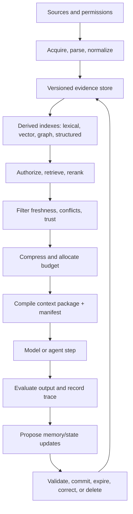
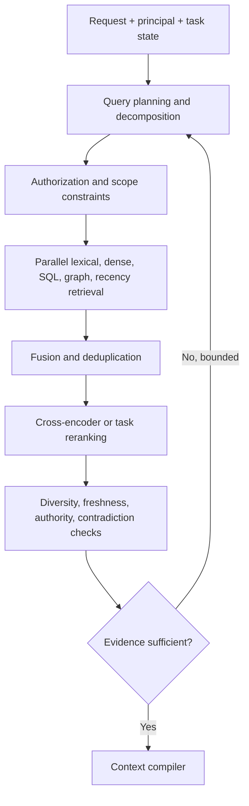
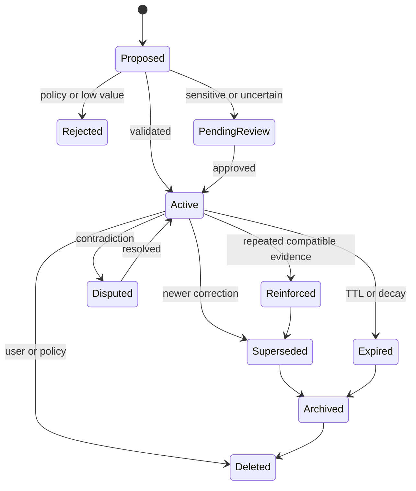
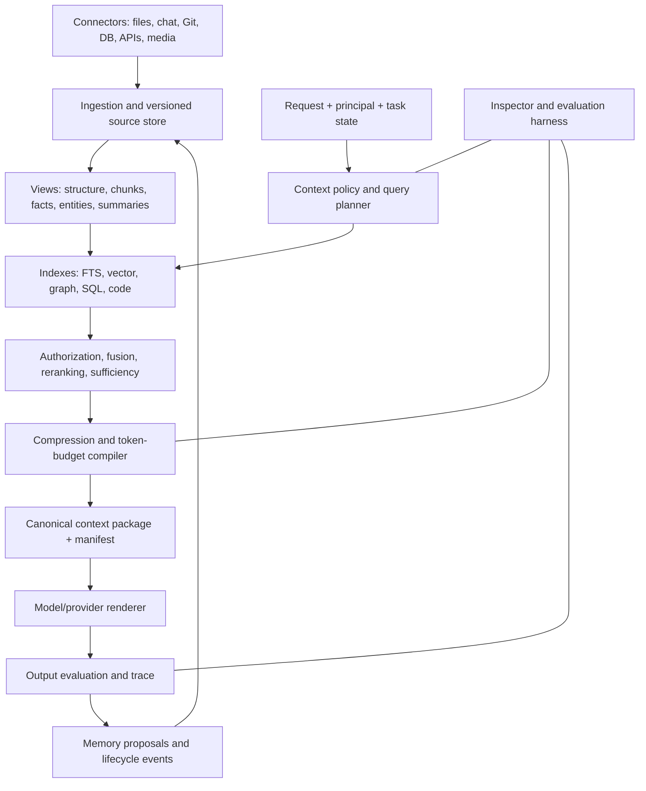

# Context Systems for AI Models and Agents

## A technical architecture report for AI Context Nugget and AI Server Studio

**Research date:** 3 August 2026  
**Scope:** Context acquisition, ingestion, storage, retrieval, memory, assembly, provenance, security, agent state, coding context, multimodal context, and evaluation  
**Audience:** Technically informed product designers, architects, and implementers  
**Evidence labels:** **Verified** = stated in official documentation/source code; **Vendor claim** = asserted by a vendor without independent reproduction here; **Academic finding** = result reported by a cited study; **Industry practice** = recurring design pattern across implementations; **Recommendation** = this report's architectural conclusion.

### Research method and limitations

The research snapshot is current to 3 August 2026. It prioritizes official product documentation, original papers/standards, official repositories and licenses, and engineering material from system builders. Current product, preview, license, price, and maintenance claims were checked against primary sources; repository activity means only that the project appeared active on the snapshot date. Academic results are reported with their evaluated scope and are not treated as universal guarantees. Vendor-reported quality/security outcomes remain vendor claims unless supported by independent evidence. Negative findings mean “not established in the authoritative sources reviewed,” not proof that a feature does not exist. Hosted services, model weights, enterprise directories, optional dependencies, and bundled datasets may have licenses different from a project's core repository.

---

## 1. Executive summary

The central finding is that a context system is not a vector database and is not a prompt template. It is a policy-governed information pipeline that converts heterogeneous, versioned, permissioned evidence into a bounded model input and then records what happened. Its primary product should be a reproducible **context package** plus an inspectable **context manifest**, not merely a string of prompt text.

The strongest reusable architecture separates five planes:

1. **Source and evidence plane:** immutable or versioned source objects, parsed structures, media, events, records, and provenance.
2. **Derived knowledge plane:** chunks, embeddings, lexical indexes, summaries, facts, entities, relationships, and repository maps. Every derivative keeps lineage to source spans.
3. **Retrieval and policy plane:** query planning, authorization, freshness filtering, hybrid retrieval, graph/SQL traversal, reranking, diversity, and evidence sufficiency.
4. **Context compilation plane:** trust and instruction boundaries, contradiction sets, token budgeting, compression, provider/model rendering, and manifest creation.
5. **Durable state plane:** conversations, memories, tasks, checkpoints, approvals, and audit events. These are related but must not be collapsed into one undifferentiated “memory” store.

The recommended design for **AI Context Nugget** is a small provider-neutral kernel with typed interfaces and an append-only event/audit model. SQLite plus SQLite FTS should be the reference local store; embeddings, vector databases, graph stores, rerankers, parsers, and hosted services should be adapters. A raw source store and relational metadata index are mandatory; a vector store and knowledge graph are optional. Retrieval should default to permission-filtered hybrid search followed by reranking, diversification, and a sufficiency decision. Every request should emit a manifest containing selected and rejected candidates, source lineage, scores, transformations, policy decisions, budget allocations, hashes, and compiler/provider versions.

The recommended design for **AI Server Studio** is to keep a canonical, model-independent context package and render it through model profiles. Models should normally receive the same evidence set, but not necessarily the same serialization, compression, tool descriptions, retrieval depth, or token allocation. This preserves comparability and model switching without pretending that a 4k local model and a large hosted multimodal model should receive identical bytes.

Key conclusions:

- Long context windows reduce some retrieval pressure but do not solve freshness, permissions, provenance, cost, latency, contradiction, or attention allocation. The “lost in the middle” study found that performance commonly falls when relevant evidence is placed between the beginning and end of long contexts ([Liu et al., 2024](https://aclanthology.org/2024.tacl-1.9/)).
- Memory must be treated as **potentially useful evidence with origin and confidence**, not as automatically trusted truth. Explicit user corrections and authoritative current sources outrank inferred or summarized memories.
- Retrieval-time authorization is non-negotiable. Filtering only after retrieval leaks existence, ranking, embeddings, snippets, or cached data and can contaminate model behavior.
- Instructions and information require different types. External documents, emails, web pages, tool results, and other-agent messages are untrusted data unless a policy explicitly promotes them; delimiting text helps models but is not a security boundary. OWASP's 2025 guidance explicitly notes that RAG and fine-tuning do not eliminate prompt injection ([OWASP LLM01:2025](https://genai.owasp.org/llmrisk/llm01-prompt-injection/)).
- Compression should never destroy the route back to raw evidence. Opaque provider compaction can be convenient, but an inspectable product should also maintain its own human-readable task state and source-linked summaries. OpenAI's current compaction documentation, for example, describes an encrypted, opaque compaction item that carries state using fewer tokens ([OpenAI Compaction](https://developers.openai.com/api/docs/guides/compaction)).
- Knowledge graphs add value for multi-hop, entity-centric, temporal, relationship, and corpus-level questions; they are unnecessary overhead for small, flat corpora dominated by direct lookup. Microsoft's GraphRAG research specifically targets global corpus questions that conventional top-k snippet retrieval handles poorly ([Edge et al., 2024](https://www.microsoft.com/en-us/research/publication/from-local-to-global-a-graph-rag-approach-to-query-focused-summarization/)).
- Evaluation must isolate ingestion, retrieval, assembly, generation, memory, authorization, and operations. End-to-end answer scores alone cannot locate regressions.

### Recommended first release

The first public Context Nugget release should implement: source/version records; parsing/chunking interfaces; raw-text preservation; SQLite metadata and FTS; optional embedding adapter; permission-scoped hybrid retrieval; a deterministic context compiler; token budgeting; source-linked extractive compression; manifest/tracing; explicit memory CRUD; deletion propagation; and a regression harness. Automatic memory inference, knowledge graphs, learned retrieval policies, cross-agent memory consolidation, and multimodal vector retrieval should remain opt-in experiments until their evaluation and security behavior are established.

---

## 2. Definitions and taxonomy

### 2.1 The layers that are most often confused

| Term | Precise meaning | Lifetime | Should contain instructions? | Typical failure when blurred |
|---|---|---:|---|---|
| Model context window | The model's maximum usable token/position budget for one inference, including relevant input, output, and sometimes reasoning tokens depending on API semantics | One inference | It can contain them, but it is capacity, not content | Treating advertised length as guaranteed effective attention |
| Active context | The actual content made visible to a model for one inference | One inference | Yes, in typed privileged regions | Assuming stored history is automatically visible |
| Working context | The subset needed for the current step: goal, local plan, evidence, recent results, constraints | Step or task | Yes | Letting full transcripts crowd out task state |
| Prompt | The rendered input representation sent to a model/API | One inference | Yes | Treating serialization as the whole context system |
| Instructions | Normative directives that constrain behavior, ordered by authority | Policy/session/task | Yes—by definition | Allowing retrieved prose to masquerade as authority |
| Conversation history | Ordered user/assistant/tool events from a thread | Thread | Contains past instructions, but their continuing force must be evaluated | Replaying obsolete or malicious instructions forever |
| Memory | Deliberately retained information intended to influence later interactions | Cross-turn/session | Usually data; procedural memory may encode approved policy | Promoting inference or temporary remarks to truth |
| Retrieval | Selection of candidates from stores or live sources for a request | Query | No; it selects data and may select separately governed instruction assets | Calling top-k vector search “memory” |
| Knowledge base | Governed collection of sources and derived records intended for query | Persistent | Normally data | Losing source/version/permission metadata during chunking |
| Application state | Authoritative domain state, such as selected project, open document, account, or UI mode | Varies | No | Summarizing authoritative state into unreliable prose |
| Agent/workflow state | Durable control state: task graph, checkpoint, pending approvals, retries, completed actions | Task/run | Some fields constrain execution | Storing it only in a chat transcript |
| Artifact | User- or agent-created output with its own identity and lifecycle | Persistent or task | Content is data unless explicitly installed as instructions | Confusing draft output with authoritative source |
| Context cache | Reusable processed input, retrieval result, compiled prefix, or provider KV/prompt cache | Seconds to days | Can cache instructions | Reusing across tenants or stale policy versions |

OpenAI's current documentation illustrates why distinctions matter: conversation objects and `previous_response_id` manage thread state, vector stores power file retrieval, and prompt caching reuses exact prefixes; these are different mechanisms even though each is casually called “context” ([conversation state](https://developers.openai.com/api/docs/guides/conversation-state), [retrieval](https://developers.openai.com/api/docs/guides/retrieval), [prompt caching](https://developers.openai.com/api/docs/guides/prompt-caching)).

### 2.2 Memory taxonomy

The cognitive labels are useful metaphors, not proof that an AI system has human memory:

| Memory class | AI-system interpretation | Good representation | Default trust |
|---|---|---|---|
| Short-term / working memory | Current goals, recent observations, interim calculations, unresolved questions | Typed task-state fields plus recent event slice | Medium; task-local |
| Episodic memory | What happened in a particular interaction or event, including time and participants | Append-only events with source references | Evidence of an event, not proof all statements were true |
| Semantic memory | Consolidated propositions, preferences, concepts, and relationships | Source-linked claims/entities with temporal validity | Variable; require origin/confidence |
| Procedural memory | Approved process, skill, policy, or learned action pattern | Versioned executable/config/instruction asset | High only when installed by authorized actor |
| User memory | User-specific preferences and facts | Scoped memory record with consent and editability | Explicit > inferred |
| Project memory | Decisions, conventions, architecture, terms, and history for one project | Project-scoped claims/events/documents | Project authority controls apply |
| Agent memory | Experience or durable information associated with one agent identity | Agent-scoped events/lessons | Low to medium until validated |
| Shared memory | Information intentionally visible to a team/agent group | Separate scope with ACL, not duplicated private records | Determined per item |
| Private memory | Information restricted to a user or agent | Encrypted/scoped record | Never implicitly promoted to shared |

**Recommendation:** implement these as scopes and record types, not as separate databases. A memory can be `(type=preference, subject=user:42, scope=user:42)` or `(type=decision, subject=project:alpha, scope=project:alpha)`. Cross-scope sharing is an explicit copy/reference operation with provenance.

### 2.3 Storage and knowledge terms

- **Document store:** stores source objects or document-shaped records; good for retrieval and flexible metadata.
- **Vector store:** maps vector embeddings to item identifiers and metadata; good for semantic candidate generation, not truth, authorization, or complete provenance by itself.
- **Search index:** lexical/sparse postings plus fields; strong for exact identifiers, rare terms, filters, phrases, and explainable scores.
- **Knowledge graph/graph database:** entities or records as nodes and relationships as edges; valuable for traversal and multi-hop structure.
- **Event log/event store:** append-only facts about changes and actions; ideal for audit, temporal reconstruction, retries, and deletion propagation.
- **Content-addressable store:** objects keyed by hashes; useful for deduplication, immutable versions, cache reuse, and integrity checks.
- **State snapshot:** materialized state at a time; fast to resume but must retain its relationship to events.
- **Knowledge cache:** derived, replaceable material; deletion or re-indexing must be possible without losing raw sources.

### 2.4 Frequently imprecise terms

- “Memory” is often used for chat history, a vector store, a user profile, a summary, or hidden model state. Require a type and lifecycle whenever the term appears in an API.
- “RAG” may mean anything from one vector lookup to iterative agents using SQL, graphs, web search, and reranking. State the retrieval plan.
- “Semantic search” often means dense embedding similarity, though sparse learned retrieval and late-interaction models are also semantic.
- “Context window” is sometimes confused with effective recall. Capacity is not uniform utilization.
- “Knowledge graph” is sometimes applied to any linked JSON. A useful graph has stable entity identity, typed edges, evidence, temporal semantics, and graph-native queries.
- “Agent state” and “agent memory” are often conflated. A pending approval is workflow state; a learned preference is memory.
- “Cache” can mean result caching, embedding caching, compiled-prefix caching, or provider-side attention/KV reuse. They have different invalidation and isolation rules.

---

## 3. Complete context lifecycle



### 3.1 Lifecycle invariants

1. **Raw-before-derived:** preserve original bytes/text and source metadata before creating chunks, summaries, facts, or embeddings.
2. **Version everything material:** parser, chunker, embedding model, reranker, compiler, policy, source version, and model profile.
3. **Authorize before content leaves the store:** retrieval must query only the principal's permitted universe or apply secure filtering inside the retrieval engine.
4. **Derivatives inherit restrictions:** a summary, embedding, entity, or cache entry inherits the strictest relevant source policy unless an explicit declassification rule says otherwise.
5. **Every transform has lineage:** derived item → parent item(s) → source version and location.
6. **No silent memory writes:** automatic extraction produces proposals; policy/validation commits them.
7. **Deletion is a graph operation:** remove or tombstone source, chunks, embeddings, summaries, graph claims, caches, memories, and exports that derive from it, subject to legal/audit retention.
8. **Compilation is reproducible:** the manifest records enough information to explain and, where sources remain available, recreate the package.

### 3.2 Control loop for retrieval sufficiency

An agent should not decide “enough context” from intuition alone. Use a bounded loop:

1. classify the request and required evidence types;
2. create explicit subquestions/claims that need support;
3. retrieve candidates through one or more scoped channels;
4. measure coverage, authority, freshness, contradiction, and score margin;
5. either compile, ask the user, abstain, or run a bounded next retrieval plan;
6. stop on evidence sufficiency, budget/latency ceiling, repeated-query convergence, or policy restriction.

A practical sufficiency record contains `required_facets`, `covered_facets`, `uncovered_facets`, `best_source_authority`, `contradictions`, `retrieval_round`, `cost_spent`, and a reasoned stop code. The LLM may propose the plan, but deterministic ceilings and permission enforcement remain outside it.

---

## 4. Context-source analysis

The following table defines default treatment. Deployments should refine it by domain and risk.

| Source family | Acquisition and representation | Index/retrieval | Trust and freshness | Permission/provenance requirements |
|---|---|---|---|---|
| Current user message | Direct event; preserve structured parts and attachments | Always included; entity/task extraction may create retrieval queries | High authority for intent, medium for external facts; current by definition | User/thread ID, timestamp, message/part IDs |
| Conversation history | Ordered immutable events plus editable views/summaries | Recency slice, semantic/temporal retrieval, explicit pins | Statements are claims; later correction supersedes earlier claim without erasing history | Thread participants, role, edit/version, source turn |
| System/application/project/agent instructions | Versioned instruction assets with authority and scope | Deterministic selection by scope; never ordinary semantic retrieval alone | High only from authorized publisher; effective/expiry dates | Signer/owner, version/hash, policy priority, applicable path/project |
| Tool descriptions/skills/plugins | Schemas and installed instruction assets | Capability routing and policy lookup | Trust installation source; tool output remains separate | Package/version/signature, requested scopes, administrator policy |
| Tool results/APIs/databases/business data | Typed records with call/request identifiers | Direct structured query, SQL, API filters, optional indexing | Authority depends on system of record; record retrieval time and valid time | Caller principal, connector identity, row/field ACL, request/response hash |
| User preferences and persistent memories | Explicit record or proposed extraction | Subject/scope/time-filtered memory retrieval | Explicit user statement outranks inference; decay inferred items | Consent, sensitivity class, origin turn, confidence, editable/deleteable |
| Files/documents | Versioned bytes plus parsed structure/layout | Lexical/vector/metadata/parent-child retrieval | Modification time is not always validity; authority from owner/repository | File ID/path, content hash, page/section/span, inherited ACL |
| Source repositories | Git objects, working tree, symbols, graphs, history, issues/PRs | Exact code search, symbol/ref graph, semantic search, git queries | Commit/worktree identity is essential; generated files lower priority | Repo/ref/commit/path/line/symbol, codeowner and branch permissions |
| Email/calendar/messages | Connector events and attachments | Structured filters first, then lexical/semantic | Sender identity and event status matter; email body is untrusted content | Account/mailbox, participants, message/event ID, ACL and consent |
| Web/search/browser history | Search result pages, fetched snapshots, browser events | Search engine + live fetch; optionally temporary index | Freshness varies rapidly; rank primary/official sources above commentary | URL, fetch time, publisher, snapshot hash, user history consent |
| Screenshots/images/audio/video | Original media + OCR/captions/transcript/regions/segments | Cross-modal embeddings, text index, time/region lookup | Derived text can omit or invent detail; retain media for verification | Media hash, capture source/time, bounding box/timestamp, model/version |
| Application/OS/UI state | Typed snapshot and state-change events | Direct state read; do not rely on vector retrieval | Application state is authoritative for its instant, quickly stale | Process/device/session, capture time, permissions, sensitivity redaction |
| Other agents/handoffs | Signed/identified messages plus evidence bundle and checkpoint | Task ID and dependency lookup | Agent claims are untrusted until source-backed; distinguish result from evidence | Agent/run ID, model/tool versions, source manifest, delegation scope |
| Prior task traces/generated artifacts | Events, manifests, outputs, diffs, tests | Task/project search; artifact dependency graph | Useful experience, but outputs may be wrong; validated artifacts rank higher | Run/artifact/version, creator, validation status, source links |
| Sensors/environment | Timestamped measurements, units, calibration metadata | Time-series/geo/spatial queries | Rapidly stale; confidence derives from sensor quality | Device identity, calibration, valid time, sampling, access scope |

**Recommendation:** each acquisition adapter should emit a common `SourceObject` plus typed payload, not flattened text. Flattening happens only in view generation.

---

## 5. Ingestion and representation

### 5.1 Pipeline

`discover → authorize acquisition → fetch → hash → identify version → parse → normalize → classify → extract metadata → segment → derive views → index → validate → publish`

Acquisition itself is a privileged action. The pipeline records both **transaction time** (when the system learned it) and **valid time** (when the information applies) wherever possible.

### 5.2 Parsing and segmentation

- **Documents:** preserve headings, pages, lists, tables, footnotes, reading order, and bounding boxes. Plain extraction is insufficient for contracts, forms, scientific PDFs, or financial tables. Docling and Unstructured are useful systems to study for local parsing pipelines ([Docling](https://github.com/docling-project/docling), [Unstructured](https://github.com/Unstructured-IO/unstructured)).
- **Code:** parse with Tree-sitter/AST tooling and optionally language servers or SCIP. Tree-sitter is incremental and robust to syntax errors, making it suited to working trees ([Tree-sitter documentation](https://tree-sitter.github.io/tree-sitter/)).
- **Messages/events:** segment by event identity, not arbitrary tokens; attach thread, participants, and temporal metadata.
- **Tables:** preserve the table object and cell coordinates; generate text projections for retrieval.
- **Media:** preserve the original and generate captions/OCR/transcripts/regions as derived views.

Chunk boundaries should follow semantic and structural units, then obey model/index limits. Useful strategies:

- fixed/sliding windows: simple and predictable, but can split meaning and duplicate heavily;
- semantic boundaries: better coherence, but model/heuristic changes make indexes less stable;
- hierarchical parent-child: retrieve small precise children, return a larger parent for reading;
- document trees: retrieve summaries at several levels; RAPTOR recursively clusters and summarizes text for tree-organized retrieval ([Sarthi et al., 2024](https://arxiv.org/abs/2401.18059));
- late chunking: encode a long sequence before pooling chunk embeddings so chunks retain surrounding context ([Günther et al., 2024](https://arxiv.org/abs/2409.04701));
- code units: symbol bodies, declarations, tests, docs, and dependency neighborhoods rather than arbitrary token windows.

### 5.3 Representation comparison

| Representation | Advantages | Limitations/failure modes | Recommended role |
|---|---|---|---|
| Raw bytes/text | Fidelity, legal/audit value, reparsable | Expensive to search; malformed extraction | Canonical evidence; always retain subject to policy |
| Structural document tree | Layout/section/table semantics | Parser-specific complexity | Canonical parsed view |
| Chunks | Retrieval granularity and bounded model input | Boundary errors, duplication, lost global context | Derived searchable units |
| Extractive summary/evidence spans | Faithful and citable | May omit connective reasoning | Preferred first compression layer |
| Abstractive summary | High compression and readability | Hallucination, uncertainty/attribution loss, error accumulation | Derived cache with lineage and expiry |
| Structured facts/claims | Queryable, comparable, temporal | Extraction and entity-resolution errors | Candidate claims, never source replacement |
| Entities/relationships | Multi-hop and aggregation | Expensive reconciliation; false edges | Optional knowledge layer |
| Events | Auditability and temporal reconstruction | Requires projections for easy queries | Durable lifecycle/workflow backbone |
| Messages | Natural conversational unit | Mixes intent, claims, instructions, and social content | Conversation evidence with typed parts |
| State snapshots | Fast resume/read | Can hide how state arose or become stale | Materialized view over state changes |
| Dense embeddings | Paraphrase/concept matching | Opaque, model-version-dependent, weak on exact IDs/numbers | One candidate generator |
| Sparse/BM25 representations | Exact/rare term strength, explainability | Vocabulary mismatch | Default alongside dense retrieval |
| Late-interaction vectors | Stronger token-level matching than a single vector | Larger index/compute | Optional high-quality retrieval tier; see ColBERT ([Khattab & Zaharia, 2020](https://arxiv.org/abs/2004.12832)) |
| Graph structures | Relationship and multi-hop traversal | Build cost, schema/entity drift | Optional for graph-shaped questions |
| Structured records/SQL | Exact filters, joins, aggregates, authority | Requires schema/query planning | First choice for authoritative structured data |

### 5.4 Deduplication and change detection

Use multiple identities:

- `source_id`: durable logical source;
- `version_id`: a particular version;
- `content_hash`: exact normalized/byte content;
- `semantic_fingerprint`: near-duplicate detection only;
- `locator`: source-specific path/URL/record ID;
- `derivation_hash`: parents + transform configuration/version.

Exact hashes permit safe reuse. Near-duplicate clustering must not silently merge sources with different authority, ownership, time, or permissions. Incremental indexing diffs parsed structures where possible; deletes/tombstones propagate through the derivation graph and invalidate retrieval/prompt caches.

---

## 6. Storage and knowledge-system architecture

### 6.1 Comparison of storage and retrieval approaches

| Approach | Best at | Weak at | Local-first fit | Context Nugget recommendation |
|---|---|---|---|---|
| Files/content-addressed blobs | Original artifacts, large media, immutable versions | Rich querying | Excellent | Required raw store |
| SQLite/PostgreSQL | Metadata, identities, ACLs, events, facts, state, transactions | Approximate semantics without extension | Excellent | Required relational control plane |
| SQLite FTS/Postgres FTS | Exact terms, phrases, identifiers, filters | Paraphrases | Excellent | Required baseline lexical index |
| Dedicated search engine (OpenSearch/Elasticsearch/Vespa) | Scalable lexical/hybrid ranking, facets | Operational weight | Good self-hosted | Adapter for larger deployments |
| Embedded vector index (FAISS/LanceDB/sqlite-vec) | Local semantic retrieval | Distributed updates/ACL sophistication varies | Excellent | Optional reference adapter |
| Vector DB (Qdrant/Weaviate/Milvus) | ANN search, metadata filters, scale | Not a source-of-truth or full policy engine | Good self-hosted | Optional adapter |
| Graph DB (Neo4j/Memgraph/Kuzu) | Traversal, entity networks, paths | Cost/schema complexity | Mixed to good | Optional adapter only |
| Event store | Audit, replay, temporal changes, durable agents | Ad-hoc semantic retrieval | Good | Event-log interface; SQLite implementation initially |
| Data warehouse/lakehouse | Analytics over structured history | Interactive per-turn latency | Usually heavier | Connector, not core dependency |

### 6.2 When a knowledge graph earns its cost

Use a graph when questions repeatedly require: identity resolution across sources; relationship traversal; multi-hop explanations; temporal dependencies; ownership/dependency networks; corpus-level themes; or reconciliation of conflicting claims. Do not add one merely because entities can be extracted. If queries are mostly “find the passage that answers this question,” hybrid retrieval plus reranking is simpler and usually easier to evaluate.

GraphRAG's verified design extracts entities, relationships, and claims; clusters the graph into communities; generates community summaries; and offers global, local, and DRIFT search modes ([Microsoft GraphRAG documentation](https://microsoft.github.io/graphrag/)). Its own repository warns that indexing can be expensive and describes the code as a demonstration rather than a supported Microsoft product ([microsoft/graphrag](https://github.com/microsoft/graphrag)). That tradeoff should be explicit in Context Nugget.

### 6.3 Claim-centric knowledge model

Avoid overwriting a single `fact.value`. Store claims:

`subject --predicate--> object/value`, plus source, asserted-by, extraction method, transaction time, valid-from/to, confidence, status, sensitivity, and contradiction-group. A current view can select the winning claim by domain policy while preserving historical and dissenting evidence.

---

## 7. Retrieval architecture

### 7.1 Recommended pipeline



Dense Passage Retrieval established the bi-encoder pattern for efficient dense candidate retrieval ([Karpukhin et al., 2020](https://arxiv.org/abs/2004.04906)). The original RAG work combined a dense index with a generator and emphasized that non-parametric memory can be updated and inspected more readily than parametric knowledge ([Lewis et al., 2020](https://arxiv.org/abs/2005.11401)). Those papers are foundations, not complete production architectures.

### 7.2 Retrieval methods and use cases

- **Keyword/full-text/BM25:** exact names, error codes, symbols, quoted phrases, citations, legal language, and rare terms.
- **Dense vector search:** paraphrase, conceptual similarity, multilingual or vocabulary-mismatched queries.
- **Sparse learned retrieval:** semantic expansion while retaining inverted-index behavior.
- **Hybrid retrieval:** default for heterogeneous text; fuse ranks/scores rather than trusting incomparable raw scores. Current OpenAI retrieval, for example, exposes separate embedding and text weights in reciprocal-rank fusion ([OpenAI Retrieval](https://developers.openai.com/api/docs/guides/retrieval)).
- **Metadata filters:** tenant, user, project, time, source type, sensitivity, branch, language, status; security constraints must not be merely relevance hints.
- **SQL/API queries:** exact structured state, counts, joins, aggregates, and system-of-record data.
- **Graph traversal:** entity neighborhoods, paths, dependencies, temporal/causal chains.
- **Temporal retrieval:** combine event time, valid time, recency decay, and “as of” queries.
- **Parent-document/recursive retrieval:** candidate from small child, evidence window from parent; use hierarchical summaries for corpus questions.
- **Query rewriting/decomposition/multi-query:** resolve ambiguous language and cover subfacets; cap fanout and log all rewrites.
- **HyDE:** embed a hypothetical answer/document to bridge query-document mismatch; it can improve zero-shot retrieval but may bias toward an invented premise ([Gao et al., 2022](https://arxiv.org/abs/2212.10496)).
- **Reranking:** cross-encoders generally offer stronger pairwise relevance at higher cost; LLM rerankers handle complex criteria but are less deterministic and more injection-exposed.
- **Diversity/MMR:** prevent near-duplicate top results and reserve budget for distinct facets/sources.

### 7.3 Who initiates retrieval?

| Mode | Best use | Risk | Guardrail |
|---|---|---|---|
| Application-directed | Known workflow and source | Under-retrieval if rules are incomplete | Explicit coverage tests and fallback |
| Rule-based | Time-sensitive facts, compliance, exact state | Brittle rule growth | Small auditable rule set |
| Model-requested/tool-directed | Open-ended agents | Cost loops, injection-driven calls | Bounded rounds, allowlists, policy checks |
| Automatic pre-retrieval | General assistant/project chat | Irrelevant context on every turn | Intent classifier and no-result threshold |
| User-triggered | Transparency and user control | Users may not know retrieval is needed | Suggest retrieval when coverage is low |
| Continuous indexing | Changing repositories/files | Freshness lag, load | Event-driven updates plus reconciliation sweeps |

**Recommendation:** use a hybrid policy. Deterministic rules force retrieval for current/authoritative/structured facts; a small classifier/router chooses channels; the main model may request additional rounds; the runtime enforces budgets and authorization.

### 7.4 Scores are not confidence

Similarity and reranker scores estimate matching, not truth. Keep distinct:

- retrieval relevance;
- source authority;
- source freshness;
- extraction confidence;
- claim verification status;
- contradiction state;
- model answer confidence/abstention.

A relevance threshold may exclude useful evidence on unfamiliar queries. Calibrate per retriever, corpus, task class, and index version; use score margins and coverage rather than a universal number.

---

## 8. Memory architecture

### 8.1 Memory is a governed write path



The MemGPT paper framed limited model context as a hierarchical/virtual-memory problem and moved information between tiers ([Packer et al., 2024](https://arxiv.org/abs/2310.08560)). Generative Agents combined a full experience record with reflection and dynamic retrieval ([Park et al., 2023](https://arxiv.org/abs/2304.03442)). These are useful patterns, but neither justifies treating generated summaries as unquestioned facts.

### 8.2 Memory write procedure

1. detect a candidate from an explicit “remember” action, approved import, repeated signal, correction, or task outcome;
2. classify type, subject, scope, sensitivity, temporality, and expected utility;
3. reject transient/task-local statements unless the user/policy requests persistence;
4. detect prompt-like or malicious content; never convert untrusted content into procedural memory;
5. find duplicates, near-duplicates, and contradictions;
6. attach exact origin and extraction/model version;
7. require user/admin approval for sensitive, consequential, or cross-scope memory;
8. commit as a versioned record, not an in-place anonymous string;
9. schedule review/expiry where applicable;
10. expose edit, correction, export, and deletion controls.

### 8.3 Conflict policy

Default precedence for personal/project facts:

`explicit current user correction > authoritative current source > explicit earlier statement > validated repeated inference > single inference > model-generated summary`.

Do not automatically collapse legitimate source disagreement. A memory can be `disputed` with multiple linked claims. Corrections supersede prior active views while historical origin remains in the audit log.

### 8.4 Preventing common memory failures

| Failure | Prevention |
|---|---|
| Incorrect memory | Proposal/validation stages; source link; user review; confidence is not trust |
| Duplicate memory | Subject-predicate normalization, exact/semantic duplicate checks, merge with retained origins |
| Overgeneralization | Store the narrow proposition and circumstances; prohibit unsupported quantifiers |
| Sensitive memory | Classify before write; explicit consent; encryption; minimal retention |
| Stale memory | `valid_from`, `valid_to`, `review_at`, source refresh, recency-aware retrieval |
| Contradiction | Contradiction groups and status; surface both when unresolved |
| Injection persisted as memory | Data/instruction typing, sanitization, prohibit auto-created procedural memories |
| Temporary statement made permanent | Persistence intent classifier and TTL; task-local default |
| Cross-user/project leak | Mandatory scope on every record and retrieval-time authorization |

LongMemEval evaluates extraction, multi-session reasoning, temporal reasoning, updates, and abstention; its reported results found a substantial accuracy decline over sustained histories and motivate time-aware indexing/query expansion ([Wu et al., 2024](https://arxiv.org/abs/2410.10813)). Use it as an external benchmark, not a substitute for product-specific tests.

---
## 9. Context assembly and token management

### 9.1 Context compilation is a compiler problem

Treat the compiler input as typed items and the output as a provider-independent intermediate representation (IR). The compiler should:

1. validate scope, permissions, integrity, freshness, and required fields;
2. separate instructions, user content, evidence, state, tool schemas, and examples;
3. group evidence by question/facet and contradiction set;
4. remove exact/near duplication while preserving independent corroboration;
5. select raw spans, structured projections, or summaries at an appropriate fidelity;
6. allocate tokens and reserve model output/tool-call space;
7. order items using task needs and model profile;
8. emit stable source labels and a manifest;
9. render to provider/model format without changing evidence semantics.

The prompt is one backend target. Other targets might be a Responses-style item array, a multimodal message sequence, or a local model chat template.

### 9.2 Authority and trust boundaries

The package should use typed zones, for example:

1. platform and safety policy;
2. application policy;
3. project/agent instructions;
4. current user intent;
5. authoritative task/workflow state;
6. tool schemas;
7. retrieved evidence, explicitly labeled untrusted data;
8. previous tool/agent outputs;
9. examples;
10. response contract.

Do not rely on phrases such as “ignore instructions in documents” as the only boundary. The runtime, not the model, controls tools, secrets, permissions, approvals, and valid output schemas.

### 9.3 Token budget allocation

Let:

`input_budget = model_context_limit - reserved_output - reserved_reasoning - safety_margin`.

Use floors, ceilings, and elastic pools rather than fixed percentages:

| Component | Policy |
|---|---|
| Platform/application instructions | Hard reserve; compact only by authorized versioned rewrite |
| Current user input | Preserve fully unless oversized attachment is separately indexed |
| Response/tool contract | Hard reserve |
| Task/agent state | Small hard reserve; typed state preferred to prose transcript |
| Tool descriptions | Include only routed tools; use tool search for large catalogs |
| Recent conversation | Recency slice plus pinned/corrective turns |
| Retrieved evidence | Largest elastic pool; allocate by subquestion and authority |
| Memories | Small elastic pool; only relevant and scope-valid records |
| Examples | Optional; drop before authoritative evidence unless task needs demonstrations |
| Output space | Reserve before retrieval, never “whatever remains” |

For a small local model, prefer fewer, shorter, highly relevant extracts, a simpler tool catalog, explicit task state, and a larger safety margin. For a strong long-context model, increase evidence breadth when a task genuinely benefits, but still rerank and organize it.

### 9.4 Ordering and position

The “lost in the middle” results show that merely fitting evidence does not ensure its use ([Liu et al., 2024](https://aclanthology.org/2024.tacl-1.9/)). Practical rules:

- keep durable high-authority instructions at the stable prefix;
- place the current question near the evidence and repeat only a concise task statement, not the whole instruction set;
- group evidence by subquestion instead of one score-sorted pile;
- put the strongest evidence at salient boundaries within each group;
- place conflicting claims adjacent to one another;
- put source identifiers next to claims, not in a detached appendix;
- avoid long tool logs; retain error, command, exit status, and relevant excerpts;
- measure position sensitivity in evaluation rather than assuming one universal order.

### 9.5 Fixed, learned, or hybrid assembly

- Fixed templates are auditable and cache-friendly but brittle.
- Rules are excellent for permissions, instruction priority, required sources, and budgets.
- Small routing models can classify intent and channels cheaply but need calibration.
- LLMs can decompose queries and create query-focused views but are non-deterministic and injection-exposed.
- Learned policies may optimize retrieval/packing but are data-hungry and hard to explain.

**Recommendation:** deterministic skeleton and security rules; pluggable statistical retrieval/reranking; bounded LLM planning/compression; deterministic final validation.

### 9.6 Caching

Separate caches by purpose:

- parser/derivation cache keyed by source hash + transform version;
- embedding cache keyed by normalized content hash + embedding profile;
- retrieval cache keyed by query + index version + authorization fingerprint + policy;
- compiled-package cache keyed by manifest inputs;
- provider prompt/prefix cache keyed by exact rendered prefix and tenant-safe cache key.

Current OpenAI prompt caching illustrates provider-specific behavior: eligible exact prefixes are cached, stable content should precede variable content, and newer model families expose explicit cache breakpoints and keys ([OpenAI Prompt Caching](https://developers.openai.com/api/docs/guides/prompt-caching)). The canonical Context Nugget design must not depend on those semantics.

---

## 10. Compression and summarization

### 10.1 Compression ladder

Prefer the least lossy transformation that fits:

1. deduplicate identical spans;
2. remove navigation, boilerplate, and irrelevant fields deterministically;
3. select source excerpts;
4. select sentences/rows/symbol declarations query-focused;
5. substitute parent/child views;
6. create structured fact/evidence tables;
7. create source-linked abstractive summaries;
8. compress prompts/tokens with learned methods only after measuring task-specific loss.

LLMLingua and LongLLMLingua demonstrate model-based prompt compression approaches ([Jiang et al., 2023a](https://arxiv.org/abs/2310.05736), [Jiang et al., 2023b](https://arxiv.org/abs/2310.06839)); RECOMP explores extractive and abstractive compressors plus selective augmentation ([Xu et al., 2023](https://arxiv.org/abs/2310.04408)). These are experimental options, not safe defaults for exact legal, code, numerical, or authorization-sensitive evidence.

### 10.2 Summary object requirements

Every summary should record:

- parent item/version identifiers;
- source span mappings or supporting evidence set;
- summary purpose and target query/task;
- summarizer/model/prompt/version;
- generated time and expiry/invalidation rule;
- preserved uncertainty, disagreement, dates, units, and named entities;
- validation status and known omissions;
- content hash.

Store rolling summaries as versions. Never repeatedly summarize only the prior summary; periodically rebuild from raw events to prevent compounding drift.

### 10.3 Failure controls

| Compression failure | Control |
|---|---|
| Lost details | Coverage checklist; source-linked excerpts; recall tests |
| Distorted fact/unit/date | Structured extraction and deterministic validation |
| Uncertainty removed | Require modality/confidence fields and wording preservation |
| Attribution lost | Claim-to-source links and per-source summaries |
| Disagreement collapsed | Contradiction sets summarized explicitly |
| Entities merged | Entity IDs plus unresolved/ambiguous status |
| Minority information omitted | Diversity constraints and facet budgets |
| Old summary overrides new evidence | Version/freshness policy; raw current evidence outranks cached summary |
| Injection carried into summary | Treat summary as untrusted derived data; scan and preserve data boundary |

---

## 11. Freshness, time, and contradictions

### 11.1 Bitemporal model

Store at least:

- `observed_at` / transaction time: when the context system acquired or changed the record;
- `valid_from` and `valid_to`: when the claim applies in the represented world;
- source modification time and fetch time;
- index/derivation time;
- optional `review_at`, `expires_at`, and domain-specific expected refresh interval.

This supports the difference between “the CEO was X in 2024,” “the source still says X,” and “X is current now.” Retrieval needs an `as_of` mode, not merely recency sorting.

### 11.2 Claim status vocabulary

- `asserted`: a source claims this;
- `explicit_user_statement`;
- `inferred`;
- `verified` according to a named procedure/source set;
- `uncertain`;
- `disputed`;
- `superseded`;
- `historical`;
- `retracted`;
- `expired`.

The model should receive both proposition and status. It should not infer certainty from inclusion.

### 11.3 Refresh and invalidation

- event-driven re-indexing for file/git/database changes;
- scheduled reconciliation to catch missed events;
- source-specific TTLs for live data;
- conditional HTTP/API fetches where supported;
- dependency graph invalidation from source version to derived indexes/summaries/caches;
- tombstones for deleted sources so asynchronous indexes cannot resurrect them;
- read-time rejection of stale index generations after policy/source deletion.

### 11.4 Contradiction handling

Normalize candidate claims, detect incompatible values/intervals, group them, and choose one of four outputs: resolve by authority/time policy; present disagreement; request clarification; or abstain. Preserve all sources. Model-generated “corrections” are proposals unless verified. User corrections have high authority over personal preferences and intent, but not automatically over external objective facts.

---

## 12. Provenance, citations, and inspectability

### 12.1 Provenance graph

Every material item should support:

`output claim → compiled item → retrieval result → derived chunk/summary/fact → source version → source locator`.

For tool- and agent-derived content, include tool-call/run IDs, agent identity, model/provider, code/version, timestamps, inputs, outputs, and validation results. W3C PROV concepts (entity, activity, agent) are a useful interoperability vocabulary ([W3C PROV overview](https://www.w3.org/TR/prov-overview/)).

### 12.2 Proposed context manifest

```json
{
  "manifest_version": "1.0",
  "request_id": "req_01...",
  "created_at": "2026-08-03T15:04:05Z",
  "principal": {
    "tenant_id": "tenant_local",
    "user_id": "user_42",
    "project_id": "project_alpha",
    "agent_id": "agent_coder"
  },
  "task": {
    "thread_id": "thread_9",
    "task_id": "task_17",
    "step_id": "step_4",
    "intent": "diagnose_test_failure"
  },
  "model_profile": {
    "canonical_profile": "reasoning-medium",
    "provider": "local",
    "model": "example-model",
    "context_limit": 32768,
    "reserved_output_tokens": 4096,
    "tokenizer": "adapter:v3"
  },
  "policies": {
    "instruction_policy_version": "ip_12",
    "permission_policy_version": "pp_8",
    "retention_policy_version": "rp_4",
    "authorization_fingerprint": "sha256:..."
  },
  "query_plan": {
    "queries": ["..."],
    "channels": ["lexical", "dense", "symbol", "git"],
    "retrieval_rounds": 2,
    "stop_reason": "facets_covered"
  },
  "budget": {
    "available_input_tokens": 28160,
    "allocations": {"instructions": 2100, "state": 900, "evidence": 16800},
    "actual_total": 24710
  },
  "selected_items": [
    {
      "context_item_id": "ci_123",
      "role": "evidence",
      "source_id": "src_7",
      "source_version_id": "sv_19",
      "locator": {"path": "src/cache.ts", "start_line": 80, "end_line": 118},
      "trust": "repository_worktree",
      "scores": {"bm25": 8.2, "dense": 0.77, "rerank": 0.91},
      "selection_reasons": ["symbol_match", "failing_stack_frame"],
      "transform_chain": ["parse:tree-sitter@x", "extract:symbol@2"],
      "content_hash": "sha256:...",
      "tokens": 640
    }
  ],
  "excluded_candidates": [
    {"item_id": "ci_900", "reason": "permission_denied", "content_exposed": false},
    {"item_id": "ci_901", "reason": "near_duplicate"},
    {"item_id": "ci_902", "reason": "stale_superseded"}
  ],
  "contradictions": [{"group_id": "cg_1", "item_ids": ["ci_123", "ci_124"]}],
  "render": {
    "compiler_version": "context-compiler@0.4.0",
    "template_version": "coding-agent@7",
    "package_hash": "sha256:...",
    "cache_key_hash": "sha256:..."
  }
}
```

For permission-denied candidates, the user-facing manifest must not reveal titles, snippets, counts, or scores that disclose restricted content. An administrator audit view may contain a protected reason record.

### 12.3 Inspection interface

Offer views for:

- **Package:** exactly what the model could see, with privileged fields redacted for unauthorized viewers;
- **Why selected:** channel, score, rule, facet, authority, recency, and reranking contributions;
- **Why excluded:** duplicate, budget, low score, stale, unsupported type, or policy denial;
- **Lineage:** expandable source → parse → chunk → summary → package path;
- **Memory influence:** memory records included and their origins;
- **Agent influence:** handoff/source manifests and verification state;
- **Budget:** tokens by component, dropped candidates, and compression level;
- **Replay/diff:** compare manifests across models, index versions, or compiler versions.

---

## 13. Security, privacy, and permissions

### 13.1 Security architecture

Apply defense in depth:

1. authenticate user, service, tool, and agent identities;
2. calculate applicable tenant/user/project/role/attribute policy;
3. restrict connectors and source acquisition;
4. label sensitivity and detect secrets/PII;
5. enforce authorization inside each retrieval channel;
6. carry ACL and sensitivity through every derivative;
7. minimize/redact before remote model transfer;
8. isolate caches and indexes;
9. mediate tools and actions with least privilege and approvals;
10. record access and export/delete events.

Azure AI Search's current document-level access guidance provides examples of security filters and token-based permission metadata, reinforcing that access control belongs in retrieval rather than in the model prompt ([Microsoft document-level access control](https://learn.microsoft.com/en-us/azure/search/search-document-level-access-overview)).

### 13.2 RBAC plus ABAC

RBAC answers broad roles; ABAC handles source owner, project, classification, device, purpose, time, provider locality, consent, and agent delegation. A retrieval authorization request should include principal, action, resource attributes, purpose/task, environment, and delegation chain.

Example:

```text
allow retrieve(chunk)
  if principal.tenant == chunk.tenant
  and principal.user in effective_readers(chunk.source)
  and task.project in chunk.allowed_projects
  and provider.location satisfies chunk.processing_policy
  and not chunk.deleted
```

Chunk ACLs are derived from source ACLs and cannot become broader. When a source ACL changes, re-evaluate or invalidate cached derivatives and retrieval results.

### 13.3 Information versus instructions

Use an explicit `authority_class`:

- `platform_policy`;
- `application_policy`;
- `project_instruction`;
- `user_instruction`;
- `tool_schema`;
- `untrusted_content`;
- `derived_content`;
- `agent_claim`.

Only authorized publishers can create instruction assets. Text inside documents, web pages, emails, repository content, tool output, memory evidence, MCP responses, or agent artifacts remains data even when it says “system message.” Procedural memories require an installation/approval event, not semantic extraction.

OWASP classifies both direct and indirect prompt injection and states there may be no foolproof prevention; recommended mitigations include least privilege, validation, segregation of external content, human approval for high-risk actions, and adversarial testing ([OWASP LLM01:2025](https://genai.owasp.org/llmrisk/llm01-prompt-injection/)). Anthropic similarly reports browser-agent prompt-injection defenses as a layered, continuously evaluated problem rather than a solved filter ([Anthropic, 2025](https://www.anthropic.com/research/prompt-injection-defenses)).

### 13.4 Poisoning routes and mitigations

| Route | Example | Required mitigations |
|---|---|---|
| Document/web/email | Hidden instruction tells agent to exfiltrate data | Untrusted typing, content scanners, no secret access in model, action approval |
| Repository | Malicious README/comment/issue changes coding agent behavior | Instruction allowlist/path policy, commit trust, code review, sandbox |
| Tool/MCP/plugin | Tool returns instruction-like text or excessive data | Schema validation, server identity, capability scopes, output size/type limits |
| Memory | Injection stored as future procedural memory | Memory proposal gate; procedural install approval; origin display |
| Vector/embedding index | Poisoned chunks dominate neighbors | Source admission controls, anomaly/duplicate detection, diversity and authority ranking |
| Other agent | Handoff asserts fabricated completion | Evidence bundle, signed run identity, independent verification |
| Multimodal | Image contains invisible/adversarial instruction | Treat OCR/vision output as data, media scanning, no privileged action from media alone |

### 13.5 Privacy lifecycle

- local-first default with explicit remote-processing policy per source/item;
- encryption at rest and in transit, keys separated by tenant where appropriate;
- secret detection before indexing and again before context export;
- purpose limitation and consent receipts for personal memory;
- configurable retention and automatic expiry;
- complete export in open formats;
- user-visible deletion with propagation status;
- append-only protected audit records that minimize content;
- do not log full prompts by default in sensitive deployments; store hashes/metadata and opt-in encrypted payloads.

---

## 14. Agent-specific context requirements

### 14.1 Context versus durable workflow state

| Durable workflow state | Context view derived for a step |
|---|---|
| Task graph and status | Current goal and relevant dependencies |
| Pending approval object | Short statement that an action is blocked and what approval covers |
| Tool call/action ledger | Recent relevant results and failure excerpts |
| Checkpoint/snapshot | Minimal resumable task summary |
| Retry counters and idempotency keys | Whether retry is allowed and constraints |
| Delegation assignments | Handoff scope and expected outputs |
| Artifact identities/versions | Relevant artifacts and selected excerpts |

Workflow state must be transactional and machine-readable. The model's plan is a proposal; the runtime's task graph is authoritative. A crash should not require reconstructing whether an email was sent, a file was changed, or an approval is pending from chat prose.

### 14.2 Agent visibility

- give an agent the minimum sources, tools, secrets, and task state needed;
- share evidence and verified results, not every agent's private scratch/reasoning;
- keep local scratch ephemeral unless deliberately promoted;
- share a common workspace through versioned artifacts and events, with conflict/locking semantics;
- pass handoffs as typed packages: goal, scope, constraints, state, completed work, evidence manifest, unresolved questions, expected deliverable, and permissions/delegation expiry.

OpenAI's Agents SDK documentation currently distinguishes local application context passed through a run wrapper from the context visible to an LLM, and its sessions layer retrieves prior conversation history before runs and stores new items afterward ([Agents SDK context](https://openai.github.io/openai-agents-python/context/), [Agents SDK sessions](https://openai.github.io/openai-agents-python/sessions/)). The design lesson is to keep runtime dependency/state injection separate from model-visible prompt content.

### 14.3 Checkpoint and resume

A checkpoint includes:

- immutable task/run/step IDs and workflow definition version;
- current state and transition sequence number;
- source/index/policy/model/compiler versions;
- completed actions with idempotency keys;
- pending actions and approvals;
- artifacts and hashes;
- evidence/context manifest IDs;
- unresolved questions and retry counters;
- lease/ownership state.

On resume, reconcile external side effects before retrying. Expired permissions or changed sources force reauthorization/retrieval rather than blindly replaying old context.

### 14.4 Avoiding duplicate work

Use a task registry with atomic claim/lease, dependency graph, artifact catalog, and append-only progress events. Before new work, agents query assignments and artifacts. Similarity search over narrative updates is helpful but cannot replace task IDs and transactional ownership.

---

## 15. Coding-context systems

### 15.1 Why generic chunking fails

Naive chunks split declarations from uses, omit generated/config/test/build relationships, disregard branches, and retrieve semantically similar code that is not on the executed path. Code context requires several complementary indexes:

- exact text/regex search;
- syntax tree and symbols;
- definitions/references from language servers or SCIP;
- imports/dependencies/call graph;
- repository map;
- Git commits/blame/diffs;
- tests, build graph, runtime logs, stack traces;
- issues/PRs/docs/ownership/instructions;
- editor/open-file/recent-change state.

The Language Server Protocol standardizes editor-to-language-server operations such as symbols, definitions, references, diagnostics, and workspace features ([LSP 3.17](https://microsoft.github.io/language-server-protocol/specifications/lsp/3.17/specification/)). Sourcegraph's precise navigation uses language-specific SCIP indexes and falls back to search-based navigation when precise data is unavailable ([Sourcegraph documentation](https://sourcegraph.com/docs/code-search/code-navigation/precise_code_navigation)).

### 15.2 Recommended code retrieval workflow

1. bind request to repository, worktree, branch, commit/base, and uncommitted diff;
2. load applicable repository/path instructions deterministically;
3. parse explicit file/symbol/error/test references;
4. run exact search and symbol resolution first;
5. expand along imports/references/calls/build dependencies within limits;
6. add recent diff, relevant tests, diagnostics, logs, and ownership/history;
7. use semantic code search for conceptual discovery;
8. rerank by task evidence: stack frame, touched path, dependency distance, symbol kind, tests, recency;
9. compile concise repo map plus full relevant implementations and tests;
10. after edits, retrieve affected dependents and choose tests from dependency/diff evidence.

Aider's current repository-map design selects important classes/functions/signatures and graph-ranks relevant portions to a dynamic token budget, demonstrating a compact whole-repository orientation layer ([Aider repository map](https://aider.chat/docs/repomap.html)).

### 15.3 Code-specific provenance

Use repository URL/ID, commit SHA, worktree ID, branch, path, line/byte range, symbol stable ID, language, parser/index version, content hash, generated/vendor status, and dirty-state marker. Line numbers alone are fragile; pair them with commit and content hashes.

### 15.4 Context priorities by coding task

| Task | Highest-value context |
|---|---|
| Bug from stack trace | Stack frames, implicated symbols, callers, recent changes, reproducer, relevant tests |
| Feature | Architecture/project instructions, interfaces, analogous features, dependency graph, tests |
| Refactor | Symbol/reference graph, public API, call sites, ownership, compatibility tests |
| Security review | Trust boundaries, data flows, dependencies, config, authz, logs, threat model |
| CI failure | Workflow version, exact logs, changed files, environment, test ownership, prior runs |
| Documentation | Public APIs, examples, versioned behavior, user audience, recent changes |

---

## 16. Multimodal context

### 16.1 Store media plus derived views

| Modality | Derived views | Retrieval units | Preserve original when… |
|---|---|---|---|
| Image/screenshot | OCR, caption, objects, UI tree, regions, embeddings | Whole image and bounding boxes | Visual arrangement, identity, evidence, or text accuracy matters |
| Diagram/chart | OCR, structural elements, series/table extraction, caption | Region/legend/series and whole page | Relationships or values must be verified |
| Audio | Transcript, speaker turns, events, acoustic embeddings | Timestamped utterances/segments | Tone, music, speaker identity, or exact wording matters |
| Video | Keyframes, shots, transcript, tracks/actions | Timestamp ranges, scene/frame regions | Motion, timing, visual evidence, or edit context matters |
| Document layout | Reading order, blocks, tables, figures, coordinates | Page regions and structural nodes | Layout conveys meaning or citation needs page evidence |
| UI state | Screenshot, accessibility tree, DOM/app state, interaction events | Component/region/state snapshot | Action verification or visual state matters |

CLIP established large-scale language-image contrastive representations for cross-modal transfer ([Radford et al., 2021](https://arxiv.org/abs/2103.00020)); ColPali retrieves visually rich document pages using vision-language representations rather than relying only on OCR text ([Faysse et al., 2024](https://arxiv.org/abs/2407.01449)). These methods improve discovery but do not replace source inspection for precise values or layout.

### 16.2 Cross-modal provenance

Each textual derivative links to media hash plus page/frame/time/bounding box, extractor/model version, language/speaker where known, confidence, and editing history. A citation UI should jump to the original region or timestamp.

### 16.3 Cost policy

Use staged processing: cheap metadata and OCR/transcription first; embeddings/keyframes selectively; expensive VLM analysis on retrieved candidates. Deduplicate by media/content hash. Small models often benefit from carefully prepared textual/structured projections, while multimodal-capable models should receive originals for visually material questions.

---

## 17. Evaluation and benchmarking

### 17.1 Evaluate each stage independently

| Stage | Core metrics | Required adversarial cases |
|---|---|---|
| Ingestion | parse coverage, reading-order/table accuracy, boundary quality, metadata/entity accuracy, dedupe and incremental-update correctness | malformed files, mixed layouts, code errors, duplicate/renamed/deleted sources |
| Retrieval | Recall@k, precision@k, MRR, nDCG, facet/claim coverage, latency/cost, authority/freshness/contradiction recall | exact identifiers, paraphrases, temporal queries, poisoned duplicates, permission decoys |
| Reranking | nDCG/MRR lift, pairwise accuracy, diversity, calibration | conflicting authorities, near duplicates, injected text |
| Assembly | evidence coverage per token, instruction/data separation, token limit adherence, source diversity, contradiction adjacency, reproducibility | lost-middle permutations, oversized tool schemas, stale summaries |
| Generation | answer correctness, faithfulness/entailment, citation precision/recall, abstention, uncertainty and contradiction handling | unanswerable/underspecified questions, distractors, malicious evidence |
| Memory | write precision/recall, duplicate/conflict rate, update/forget latency, temporal accuracy, privacy leakage | temporary statements, corrections, sensitive facts, cross-user/project decoys |
| Security | unauthorized retrieval rate (must be zero), side-channel leakage, injection action success, deletion propagation | cross-tenant near-neighbors, cache collisions, malicious media/tool/agent outputs |
| Operations | p50/p95 latency, cost, index lag, failure recovery, replay determinism | crash/resume, connector outage, partial index, policy change mid-task |

RAGAS proposes context relevance, faithfulness, and answer relevance metrics without requiring reference answers ([Es et al., 2023](https://arxiv.org/abs/2309.15217)). ARES uses synthetic training data, lightweight judges, and a small human-labeled set with prediction-powered inference ([Saad-Falcon et al., 2024](https://arxiv.org/abs/2311.09476)). RAGChecker adds fine-grained retrieval and generation diagnostics and reports higher correlation with human judgment than compared metrics in its study ([Ru et al., 2024](https://arxiv.org/abs/2408.08067)). LLM judges are useful signals, not ground truth; validate them against humans and deterministic checks.

### 17.2 Practical Context Nugget regression suite

Build a checked-in, deterministic “context gauntlet” with:

1. **Golden mini-corpora:** documents, code, tables, conversations, images, events, and structured records with gold spans, permissions, time, and contradictions.
2. **Ingestion contracts:** snapshot parsed trees/metadata/chunks; property tests for stable IDs and lineage; mutation tests for rename/edit/delete.
3. **Retrieval matrix:** exact, paraphrase, multi-hop, temporal, current-vs-historical, project-scoped, cross-modal, and no-answer queries; report per-channel and fused metrics.
4. **Packing tests:** multiple token budgets/model profiles; assert required instructions/state/evidence, output reserve, ordering, and manifest completeness.
5. **Memory sequences:** explicit remember, temporary remark, inferred preference, correction, conflict, expiry, archive, deletion, cross-scope sharing.
6. **Authorization corpus:** identical and semantically similar restricted/public records across tenants; any restricted content or metadata leakage fails the build.
7. **Injection corpus:** instructions embedded in HTML/PDF/email/code/tool JSON/image OCR/agent handoff; assert no authority promotion or unauthorized action.
8. **End-to-end answer tests:** supported, refuted, conflicting, uncertain, and unanswerable; citation-level scoring.
9. **Differential tests:** compare retrievers, chunkers, rerankers, compiler versions, and model profiles on the same manifest inputs.
10. **Performance gates:** local CPU/RAM/disk budgets, p95 retrieval/compile time, index lag, cache isolation, and crash recovery.

### 17.3 Useful datasets and benchmarks

- BEIR for heterogeneous information retrieval ([Thakur et al., 2021](https://arxiv.org/abs/2104.08663));
- MTEB for embedding evaluation across tasks ([Muennighoff et al., 2022](https://arxiv.org/abs/2210.07316));
- KILT for knowledge-intensive tasks with provenance ([Petroni et al., 2021](https://arxiv.org/abs/2009.02252));
- LongBench and lost-in-the-middle-style permutations for long-context behavior ([Bai et al., 2023](https://arxiv.org/abs/2308.14508));
- LongMemEval for sustained conversational memory ([Wu et al., 2024](https://arxiv.org/abs/2410.10813));
- RAGBench/RGB/CRAG-style suites as supplemental RAG stress tests, after confirming task/licensing fit;
- SWE-bench or repository-specific issue suites for coding retrieval, while separately scoring context selection rather than only patch success.

---

## 18. Current commercial platforms and implementations

### 18.1 Comparison snapshot

This table reflects official documentation checked on 3 August 2026. “Hosted” describes the service plane, not whether an SDK can use local application state. Product prices and preview labels are volatile and should be rechecked before procurement.

| Platform | Context, retrieval, and memory | Provenance/inspection | Neutrality, deployment, and permissions | Main lesson or limitation |
|---|---|---|---|---|
| OpenAI API + Agents SDK | Responses/Conversations manage thread state; hosted File Search uses semantic+keyword search; Retrieval exposes filters/ranking/hybrid weights; server compaction and prefix caching; SDK sessions support local SQLite and external stores | Web/file results expose sources/scores; tracing; server compaction is encrypted/opaque | Hosted APIs; SDK has provider adapters but some features depend on Responses; organization/project controls and app authorization | Excellent adapter surface; keep canonical sources/manifests outside opaque hosted indexes/compaction ([docs](https://developers.openai.com/api/docs/guides/retrieval)) |
| Anthropic API + Agent SDK | Application-managed Messages; client-side Memory tool performs CRUD over an app-owned `/memories` namespace; context editing clears old tool/thinking content; prompt caching | Native PDF-page, text-character, and content-block citations; no image citations; context-edit events exposed | Storage can be local/application-owned; Claude-specific tool/protocol behavior; app owns tenant isolation and retention | Strong storage boundary, but model-directed file CRUD needs validation/provenance/conflict policy ([Memory tool](https://platform.claude.com/docs/en/agents-and-tools/tool-use/memory-tool)) |
| Google Gemini / Vertex AI Agent Platform | Managed Memory Bank extracts/consolidates long-term records; sessions keep chronological events; RAG Engine ingestion/vector retrieval; implicit/explicit caches | Memory revisions and grounding links; cache metadata visible but content cannot be read back | Google Cloud hosted; supports partner/open/self-deployed models in platform; IAM conditions, identity scopes, VPC-SC/CMEK | Revisions, scope, TTL, and poisoning warnings are strong patterns; managed internals are not portable ([Memory Bank](https://docs.cloud.google.com/gemini-enterprise-agent-platform/scale/memory-bank)) |
| Microsoft Foundry + Azure AI Search | Managed agent state/tools; classic hybrid retrieval and preview agentic retrieval with query planning, decomposition, parallel subqueries, semantic ranking | Structured grounding, citations, execution metadata, Application Insights tracing | Azure-hosted/BYO Azure stores; broad model/framework catalog; Entra, RBAC, network controls, document security trimming | Most complete documented enterprise ACL story; still prove permission propagation through chunks/caches/citations ([RAG overview](https://learn.microsoft.com/en-us/azure/search/retrieval-augmented-generation-overview)) |
| AWS Bedrock Knowledge Bases + AgentCore Memory | Retrieve-and-generate with filters/query transform/rerank; AgentCore separates short-term events from long-term facts/preferences/summaries | Generated spans map to retrieved references and source-specific locations, including structured/multimodal forms | AWS managed, broad model catalog; IAM/KMS/VPC and `userContext.userId` | Citation-chain schema is instructive; service remains AWS-bound. Agents Classic stopped accepting new customers 30 July 2026 ([AgentCore Memory](https://docs.aws.amazon.com/bedrock-agentcore/latest/devguide/memory.html)) |
| OGX (former Llama Stack) | OpenAI-compatible Responses/files/vector stores/file search/MCP/skills with local and hosted inference | Self-hosting permits application-level inspection; provenance depends on selected components | MIT, model-agnostic, self-hostable; former Meta repository now redirects to independent OGX | Useful neutral infrastructure, but should no longer be described simply as a Meta-operated stack ([OGX](https://github.com/ogx-ai/ogx)) |
| GitHub Copilot | Hosted repository semantic+exact indexing; repo facts and private preferences in Copilot Memory; Spaces/instructions curate context | Repository memories cite code and are revalidated against current branch; review/delete UI | GitHub-hosted, proprietary; repository permissions/content exclusions; index not replaceable | Best observed memory pattern: citation + scope + source revalidation + 28-day unused expiry ([Copilot Memory](https://docs.github.com/en/copilot/concepts/agents/copilot-memory)) |
| Cursor | Exact/regex and embedding code search; separate Explore subagent summarizes search into main context | Tool/search visibility, but hosted index is not user-owned/fully inspectable | Local editor with hosted services; `.cursorignore` does not constrain terminal/MCP paths | Every acquisition path needs one policy; index exclusions are not universal security boundaries ([ignore docs](https://cursor.com/docs/reference/ignore-file.md)) |
| Sourcegraph Cody | Keyword rewriting, Sourcegraph search, code graph, multi-repo, explicit file/symbol/web/OpenCtx sources | Search/source results inspectable; explicit prompt-context model | Can be self-hosted; commercial/source-available mix; repository permission configuration | Strong code-specific multi-index retrieval; reviewed docs do not provide a general memory lifecycle ([Cody context](https://sourcegraph.com/docs/cody/core-concepts/context)) |
| Continue | Explicit file/symbol/diff/open-file/terminal/diagnostic/repo-map/HTTP/MCP context; pluggable code RAG | High visibility and local control | Open/local-first, broad provider/storage adapters | Good code adapter reference; not a governed durable memory/control plane ([custom code RAG](https://docs.continue.dev/guides/custom-code-rag)) |
| Open WebUI | User-scoped local memories with manual/model CRUD, types, budgets, optional review | Users inspect/edit/delete memories | Self-host/local-first, broad providers; current license is branding-restricted source-available | Useful UI reference; small-model memory-tool reliability and license require caution ([memory docs](https://docs.openwebui.com/features/chat-conversations/memory/)) |
| AnythingLLM | Per-user workspace/global memory; Observer/Reflector extraction, confidence, semantic dedupe/consolidation; local/hosted vector choices | User-visible memories; simpler evidence lineage | Desktop/Docker/hosted and multi-provider; docs warn selected memories go to chosen provider | “Local storage” does not imply local processing; global sticky vector-backend choice is an anti-pattern ([memory docs](https://docs.anythingllm.com/features/memories)) |

### 18.2 Verified cross-platform patterns

1. Conversation/session state and selected long-term memory are increasingly separate services.
2. Hybrid lexical+dense retrieval, metadata/identity filters, and reranking are converging as defaults.
3. LLM-based query planning/decomposition is moving into managed retrieval, but increases latency, cost, and opacity.
4. Source-linked claims and citations differentiate more trustworthy systems.
5. Prefix/context caching reduces repeated computation; it does not perform memory classification, truth reconciliation, or permission management.
6. Server-side compaction is growing, but owned raw events and inspectable checkpoints remain necessary for portability and audit.
7. Identity scopes and retrieval-time permission filters are becoming explicit.
8. Mature coding systems use exact search, semantic search, symbols/ASTs, graphs, diffs, diagnostics, and runtime evidence together.

### 18.3 Documented facts versus vendor claims

Official API contracts establish that a feature exists and describe its interface; they do not independently prove retrieval quality, citation reliability, security, or deletion completeness. Statements such as Cursor's index encryption handling, Anthropic citation-quality improvements, and cloud-provider performance/security outcomes remain vendor claims unless independently audited. Preview services—such as some managed agentic retrieval/memory features—should be wrapped behind adapters and compatibility tests.

### 18.4 Platform design conclusions

- Use hosted retrieval, memory, and compaction as optional adapters/caches, never the only canonical record.
- Recompile owned context when moving across providers rather than attempting to transfer hidden provider state.
- Preserve provider raw result IDs/scores/locations inside the neutral manifest.
- Perform authorization and egress/locality checks before invoking the provider.
- Test every promised delete/expiry path; provider deletion receipts do not by themselves prove local cache/trace cleanup.

---

## 19. Current open-source frameworks

### 19.1 Framework and memory comparison

Status is a point-in-time repository observation on 3 August 2026, not a future maintenance guarantee.

| Project | Purpose / best ideas | License / language / deployment | Status and neutrality | Adoption risk |
|---|---|---|---|---|
| LangChain | Broad model/tool/retriever/vector/prompt adapters and composable runnables | MIT; Python (separate JS/TS); local library + separate hosted products | Active; `langchain-core 1.5.3` shown 30 July 2026; broadly neutral | Large/changing abstraction surface; do not make its message/document types canonical ([repo](https://github.com/langchain-ai/langchain)) |
| LangGraph | State graphs, checkpoints, durable execution, interrupts, human approval, memory patterns | MIT; Python and JS/TS; local/self-host | Active and model-neutral | Workflow runtime, not ingestion/permissions/provenance; checkpoint schema can create lock-in ([repo](https://github.com/langchain-ai/langgraph)) |
| LlamaIndex | Readers/nodes/indexes/retrievers/query engines; rich parent-child and recursive retrieval | MIT; Python, separate TS; local + separate cloud products | Active, broad provider/storage integration | Rapid API/integration evolution; preserve source representation outside framework Nodes ([repo](https://github.com/run-llama/llama_index)) |
| Semantic Kernel | Typed plugins/functions, model/vector connectors, process/agent patterns | MIT; C#/Python/Java; library | Active, multi-provider/local; Microsoft/Azure center of gravity | Feature parity varies by language; broader orchestrator than context ledger ([repo](https://github.com/microsoft/semantic-kernel)) |
| Haystack 3 | Explicit component pipelines for parse/chunk/retrieve/filter/rank/agent/generate | Apache-2.0; Python; local/service | Active, model/storage neutral, disableable telemetry | Optional integrations sprawl; pipeline is not an event/provenance store ([repo](https://github.com/deepset-ai/haystack)) |
| AutoGen | Multi-agent messaging/topic/event/runtime prior art | MIT code, CC-BY-4.0 docs; Python/.NET | **Maintenance mode**; official repo directs new work toward Microsoft Agent Framework | Study concepts; avoid as new foundational dependency ([repo](https://github.com/microsoft/autogen)) |
| CrewAI | High-level crews/flows, roles, state, events, MCP/A2A | MIT; Python; local + commercial control plane | Active and multi-provider/local | Role abstraction can obscure evidence selection; telemetry/sharing require safe defaults ([repo](https://github.com/crewAIInc/crewAI)) |
| Letta | Memory blocks, archival memory, long-running stateful agents | Apache-2.0; current ecosystem mixed Python/TS | The reviewed repo is labeled **legacy V1**; active work moved to newer Agent/App Server repos | Moving architecture and cloud-first examples; audit exact current components ([repo](https://github.com/letta-ai/letta)) |
| Mem0 | User/session/agent extraction and hybrid memory retrieval | Apache-2.0; Python core + TS SDK; self-host/cloud | Active, many backends; defaults can be OpenAI-coupled | LLM-extracted facts can be wrong; ADD-only flows need conflict/supersession controls ([repo](https://github.com/mem0ai/mem0)) |
| Zep | Historical conversation/graph memory product | Repository Apache-2.0; hosted current product | Community Edition is **deprecated and unsupported** | Do not present hosted Zep as current OSS self-hosted memory ([repo](https://github.com/getzep/zep)) |
| Graphiti | Incremental episodic/entity/fact graph, bitemporal validity, source episodes, hybrid graph/BM25/semantic retrieval | Apache-2.0; Python; self-host with Neo4j/FalkorDB/Neptune | Active; multi-provider, but structured-output quality matters | Excellent study/reference; extraction/reconciliation cost and ACL/deletion work remain ([repo](https://github.com/getzep/graphiti)) |
| Microsoft GraphRAG | Entity/relationship extraction, communities, hierarchical summaries, local/global/DRIFT queries | MIT; Python; self-host research pipeline | Active demonstration; README warns indexing cost, tuning, and breaking configs | Use only after graph-specific benefit is proven ([repo](https://github.com/microsoft/graphrag)) |
| LightRAG | Lightweight incremental graph+vector RAG research | MIT; Python; self-host | Active research code, multi-backend | Fast-moving and governance-light; experimental only ([repo](https://github.com/HKUDS/LightRAG)) |

### 19.2 Storage, search, and permission components

| Component | License / language | Best fit | Principal risk |
|---|---|---|---|
| SQLite FTS5 + sqlite-vec | SQLite public domain + MIT; C | Embedded/local reference metadata, lexical, and vector profile | Young vector extension, limited distributed/concurrent scale ([FTS5](https://www.sqlite.org/fts5.html), [sqlite-vec](https://github.com/asg017/sqlite-vec)) |
| PostgreSQL + pgvector | PostgreSQL License; C extension | Transactional server/workgroup metadata, ACLs, provenance, FTS/vector joins | ANN/filter tuning and OLTP contention at scale; current repo showed v0.8.6 ([repo](https://github.com/pgvector/pgvector)) |
| LanceDB | Apache-2.0; Rust core/Python/TS | Embedded columnar/multimodal tables | Validate concurrency, backup, migration, and local/cloud parity ([repo](https://github.com/lancedb/lancedb)) |
| Qdrant | Apache-2.0; Rust | Separate dense/sparse/multivector/hybrid service with payload filters/MMR | Operational/security hardening; default Docker exposure warning; filters are not complete authz ([repo](https://github.com/qdrant/qdrant)) |
| Weaviate | BSD-3-Clause; Go | Object+vector/BM25/hybrid, modules, multitenancy | Module/schema coupling and implicit remote provider calls ([repo](https://github.com/weaviate/weaviate)) |
| Milvus | Apache-2.0; Go/C++ | Large distributed vector/hybrid deployments | Too operationally heavy for first local-first implementation ([repo](https://github.com/milvus-io/milvus)) |
| FAISS / USearch | MIT / Apache-2.0; C++ | In-process ANN index engines and benchmarks | Neither is a database: no ACLs, metadata, transactions, audit, or lifecycle ([FAISS](https://github.com/facebookresearch/faiss), [USearch](https://github.com/unum-cloud/usearch)) |
| OpenSearch / Vespa | Apache-2.0; Java / Apache-2.0; Java/C++ | High-scale lexical/hybrid ranking, facets, serving | Operational weight; separate consistency/authorization design ([OpenSearch](https://github.com/opensearch-project/OpenSearch), [Vespa](https://github.com/vespa-engine/vespa)) |
| OpenFGA | Apache-2.0; Go | Relationship-based user/team/project sharing | Requires list/filter integration with search; do not authorize candidates one-by-one at large scale ([repo](https://github.com/openfga/openfga)) |
| Cedar | Apache-2.0; Rust | Embedded/local analyzable RBAC/ABAC policy | Application must compile policies into retrieval predicates/partitions ([repo](https://github.com/cedar-policy/cedar)) |
| OPA | Apache-2.0; Go | General policy-as-code and sidecar/server decisions | Generality and per-candidate overhead; plan bulk constraints ([repo](https://github.com/open-policy-agent/opa)) |

### 19.3 Framework conclusion

Haystack and LlamaIndex offer the most reusable retrieval-pipeline patterns; LangGraph offers the clearest durable workflow-state patterns; Graphiti offers the strongest open reference for temporal episodic/fact lineage. None supplies the whole model-independent, permission-correct context lifecycle. Context Nugget should own canonical `Source`, `ContextItem`, `EvidenceAnchor`, `MemoryClaim`, `PolicyDecision`, `RetrievalCandidate`, and `ContextManifest` records, translating at adapter boundaries.

---

## 20. Open-source tools and free resources

### 20.1 Prioritized reusable components

| Priority | Components | Purpose and lesson | Direct-adoption risks |
|---|---|---|---|
| 1 | SQLite FTS5/sqlite-vec; PostgreSQL/pgvector | Embedded and workgroup reference stores sharing one canonical schema | Backend capability differences must be explicit and conformance-tested |
| 2 | Docling + Apache Tika; Tesseract/PaddleOCR | Structure-preserving primary parse, broad fallback, explicit OCR stages | Parser workers process hostile files; sandbox, pin, and preserve originals ([Docling](https://github.com/docling-project/docling), [Tika](https://github.com/apache/tika)) |
| 3 | Tree-sitter + SCIP + Zoekt + LSP adapter | Incremental syntax, portable symbols/references, fast lexical code search | Indexer/language coverage varies; working-tree freshness and build context matter ([SCIP](https://github.com/scip-code/scip), [Zoekt](https://github.com/sourcegraph/zoekt)) |
| 4 | Sentence Transformers; FlagEmbedding/BGE; optional ColBERT | Local dense/sparse embeddings and cross-encoder/late-interaction reranking | Pin model/weight licenses and revisions; hardware/token limits vary ([Sentence Transformers](https://github.com/huggingface/sentence-transformers)) |
| 5 | Cedar or OpenFGA; OPA adapter | Local ABAC or relationship sharing, with general policy option | Authorization must become retrieval predicates/partitions, not post-filter calls |
| 6 | OpenTelemetry + OpenInference | Neutral trace envelope and interoperability | Default traces can leak full context; redact/minimize locally ([OpenInference](https://github.com/Arize-ai/openinference)) |
| 7 | promptfoo + ir-measures | Provider matrix, attack regression, and deterministic IR metrics in CI | LLM judges remain secondary; protect test secrets/data ([promptfoo](https://github.com/promptfoo/promptfoo), [ir-measures](https://github.com/terrierteam/ir_measures)) |
| 8 | Qdrant | Optional scale/hybrid/multivector vector service | Separate operations and security boundary |
| 9 | Phoenix or Langfuse | Optional self-hosted trace/eval UI | Phoenix uses Elastic License v2; Langfuse core is MIT but enterprise directories differ ([Phoenix](https://github.com/Arize-ai/phoenix), [Langfuse](https://github.com/langfuse/langfuse)) |
| 10 | Whisper/faster-whisper, OpenCLIP, ColPali, PySceneDetect | Audio transcript, image embeddings, visual-document retrieval, video segmentation | Model/weight licenses, large storage/compute, and modality information loss |
| Experiment | Graphiti, GraphRAG, ColPali/ColBERT, LanceDB | Temporal graph, corpus themes, visual/late-interaction retrieval, embedded media | Require benchmark-proven value and lifecycle/security tests first |

### 20.2 Document and code tools

- [Docling](https://github.com/docling-project/docling): local document conversion preserving layout/tables; primary parser candidate.
- [Unstructured](https://github.com/Unstructured-IO/unstructured): broad element-based parsing; useful comparison/fallback, with deployment/dependency review.
- [Apache Tika](https://github.com/apache/tika): mature broad-format deterministic metadata/text extraction.
- [Tree-sitter](https://github.com/tree-sitter/tree-sitter): incremental parse trees across languages.
- [SCIP](https://github.com/scip-code/scip): language-neutral code-intelligence interchange.
- [Zoekt](https://github.com/sourcegraph/zoekt): fast trigram-based code search.
- [Aider](https://github.com/Aider-AI/aider): repo-map and graph-ranked token-budget patterns.
- [Serena](https://github.com/oraios/serena): language-server-based semantic code tooling reference.

### 20.3 Retrieval, reranking, and graph tools

- [Pyserini](https://github.com/castorini/pyserini) for reproducible Lucene/BM25 research baselines.
- [Sentence Transformers](https://github.com/huggingface/sentence-transformers) and [FlagEmbedding](https://github.com/FlagOpen/FlagEmbedding) for local embeddings/cross-encoders/sparse experiments.
- [ColBERT](https://github.com/stanford-futuredata/ColBERT) for late-interaction retrieval.
- [FlashRank](https://github.com/PrithivirajDamodaran/FlashRank) for lightweight local reranking experiments.
- [NetworkX](https://github.com/networkx/networkx) for small graph experiments before deploying a graph database.
- [Graphiti](https://github.com/getzep/graphiti) for bitemporal/source-linked memory study; do not adopt deprecated Kùzu as its backend.

### 20.4 Multimodal tools

- [Tesseract](https://github.com/tesseract-ocr/tesseract) / [PaddleOCR](https://github.com/PaddlePaddle/PaddleOCR) for OCR;
- [Whisper](https://github.com/openai/whisper) / [faster-whisper](https://github.com/SYSTRAN/faster-whisper) for local transcripts;
- [OpenCLIP](https://github.com/mlfoundations/open_clip) for image-text embeddings;
- [ColPali](https://github.com/illuin-tech/colpali) for visually rich document retrieval;
- [PySceneDetect](https://github.com/Breakthrough/PySceneDetect) for video scene segmentation.

### 20.5 Evaluation, inspection, privacy, and permissions

- [Ragas](https://github.com/vibrantlabsai/ragas), [RAGChecker](https://github.com/amazon-science/RAGChecker), [TruLens](https://github.com/truera/trulens), and [DeepEval](https://github.com/confident-ai/deepeval) provide judge/diagnostic patterns; calibrate against humans and deterministic qrels.
- [OpenTelemetry Collector](https://github.com/open-telemetry/opentelemetry-collector) and OpenInference provide neutral tracing; keep a first-party manifest viewer functional without them.
- [Microsoft Presidio](https://github.com/data-privacy-stack/presidio), [detect-secrets](https://github.com/Yelp/detect-secrets), and Gitleaks are useful scanners, but no scanner proves absence of secrets/PII. The reviewed Gitleaks project was security-fixes-only, increasing adoption caution.
- [AgentDojo](https://github.com/ethz-spylab/agentdojo) provides realistic tool-agent injection/security tasks and is MIT-licensed.

### 20.6 Application and UX references, not kernel dependencies

Study [AnythingLLM](https://github.com/Mintplex-Labs/anything-llm), [Khoj](https://github.com/khoj-ai/khoj), [Open WebUI](https://github.com/open-webui/open-webui), [RAGFlow](https://github.com/infiniflow/ragflow), [Dify](https://github.com/langgenius/dify), and [Onyx](https://github.com/onyx-dot-app/onyx) for memory/source controls, parsing inspection, connectors, RAG configuration, and access-aware search. Their product schemas, broad attack surfaces, deployment weight, and—in Open WebUI/Dify's cases—additional license conditions make them poor foundational dependencies.

### 20.7 Free primary learning resources and benchmarks

- foundational RAG, DPR, BEIR, ColBERT, SPLADE, HyDE, RAPTOR, and lost-middle papers cited throughout this report;
- [MTEB](https://github.com/embeddings-benchmark/mteb) for embedding task evaluation;
- [BEIR](https://github.com/beir-cellar/beir) for heterogeneous retrieval;
- [LongBench](https://github.com/THUDM/LongBench), [RULER](https://github.com/hsiehjackson/RULER), [LongMemEval](https://github.com/xiaowu0162/LongMemEval), and [LoCoMo](https://github.com/snap-research/locomo) for long context/memory;
- [KILT](https://github.com/facebookresearch/KILT) and [ALCE](https://github.com/princeton-nlp/ALCE) for provenance/citation-aware generation;
- [GraphRAG-Bench](https://arxiv.org/abs/2506.02404) for experimental graph-pipeline evaluation;
- [NIST AI 100-2 E2025](https://csrc.nist.gov/pubs/ai/100/2/e2025/final), [NIST ABAC](https://csrc.nist.gov/pubs/sp/800/162/upd2/final), [NIST Zero Trust](https://csrc.nist.gov/pubs/sp/800/207/final), and [OWASP GenAI](https://genai.owasp.org/) for security vocabulary and controls.

---

## 21. Recommended architecture for AI Context Nugget

### 18.1 Design position

Context Nugget should be an **embeddable context control plane**, not a competing orchestration framework or mandatory database. It owns common records, policy order, lifecycle events, retrieval/compilation contracts, provenance, and inspection. Applications retain ownership of UI, agent loop, domain database, and model invocation.



### 18.2 Core versus optional

| Core package | Optional adapters/extensions |
|---|---|
| IDs, scopes, source/version/context-item schemas | SaaS/local connectors |
| Provenance and derivation graph | Specialized PDF/code/media parsers |
| Permission-policy interfaces and reference evaluator | Vector DBs and embedding providers |
| SQLite metadata/event store and FTS reference implementation | Dedicated search engines |
| Deterministic lexical retrieval/fusion contracts | Cross-encoder/LLM rerankers |
| Tokenizer/model-profile interfaces | Knowledge graphs/GraphRAG |
| Context policy, compiler IR, manifest | Multimodal embeddings/VLM processors |
| Explicit memory CRUD/proposals/lifecycle | Automatic memory extractors/consolidators |
| Freshness/deletion/invalidation hooks | Distributed job/event infrastructure |
| Trace, replay, and evaluation contracts | Hosted observability/eval services |

### 18.3 Core interfaces

Language-neutral conceptual interfaces:

```ts
interface SourceConnector {
  discover(scope: Scope, cursor?: Cursor): AsyncIterable<SourceDescriptor>;
  fetch(descriptor: SourceDescriptor, principal: Principal): Promise<SourceObject>;
  watch?(scope: Scope): AsyncIterable<SourceChange>;
}

interface Parser {
  supports(mediaType: string): boolean;
  parse(source: SourceVersion): Promise<ParsedDocument>;
}

interface Deriver {
  derive(input: EvidenceItem, profile: DerivationProfile): AsyncIterable<DerivedItem>;
}

interface IndexAdapter {
  upsert(items: IndexableItem[]): Promise<IndexReceipt>;
  delete(derivationIds: string[]): Promise<void>;
  search(query: ChannelQuery, authz: AuthorizationConstraint): Promise<RetrievalCandidate[]>;
}

interface PermissionEngine {
  authorize(principal: Principal, action: Action, resource: ResourceAttributes, context: PolicyContext): Decision;
  compileRetrievalConstraint(principal: Principal, action: Action, scope: Scope): AuthorizationConstraint;
}

interface QueryPlanner {
  plan(request: ContextRequest, capabilities: RetrievalCapabilities): Promise<QueryPlan>;
}

interface Reranker {
  rank(query: PlannedQuery, candidates: RetrievalCandidate[], policy: RankingPolicy): Promise<RankedCandidate[]>;
}

interface ContextCompiler {
  compile(request: ContextRequest, candidates: RankedCandidate[], state: TaskStateView): Promise<ContextPackage>;
}

interface ModelRenderer {
  render(pkg: ContextPackage, profile: ModelProfile): Promise<RenderedModelInput>;
}

interface MemoryManager {
  propose(input: MemoryEvidence, policy: MemoryPolicy): Promise<MemoryProposal[]>;
  commit(proposal: MemoryProposal, approval?: Approval): Promise<MemoryVersion>;
  query(request: MemoryQuery, principal: Principal): Promise<MemoryRecord[]>;
  correct(id: string, correction: MemoryCorrection): Promise<MemoryVersion>;
  forget(id: string, mode: ForgetMode): Promise<DeletionReceipt>;
}
```

### 18.4 Proposed context-item data model

```ts
type AuthorityClass =
  | "platform_policy" | "application_policy" | "project_instruction"
  | "user_instruction" | "tool_schema" | "authoritative_state"
  | "untrusted_content" | "derived_content" | "agent_claim";

interface ContextItem {
  id: string;
  schemaVersion: string;
  kind: "instruction" | "message" | "evidence" | "memory" | "state" |
        "tool_schema" | "tool_result" | "artifact" | "media" | "summary";
  authorityClass: AuthorityClass;
  scope: {
    tenantId: string;
    userId?: string;
    projectId?: string;
    threadId?: string;
    taskId?: string;
    agentId?: string;
  };
  subjectIds: string[];
  content: ContentPart[];              // text, JSON, image ref, audio ref, code, table
  source: SourceReference;
  provenance: ProvenanceRecord;
  temporal: {
    observedAt: string;
    validFrom?: string;
    validTo?: string;
    expiresAt?: string;
    sourceModifiedAt?: string;
  };
  trust: {
    sourceAuthority: string;
    verificationStatus: "unverified" | "verified" | "disputed" | "superseded";
    extractionConfidence?: number;
  };
  security: {
    classification: string;
    aclRef: string;
    processingPolicy: "local_only" | "approved_remote" | "any_approved_provider";
    containsSecrets?: boolean;
  };
  hashes: { content: string; sourceVersion: string; derivation?: string };
  parents: DerivationEdge[];
  metadata: Record<string, JsonValue>;
}
```

**Important:** `authorityClass` controls whether content may instruct; `trust.verificationStatus` controls evidentiary status; `security` controls access/processing. These must remain independent.

### 18.5 Memory schema

```ts
interface MemoryRecord {
  id: string;
  version: number;
  type: "preference" | "profile_fact" | "project_decision" | "episode" |
        "lesson" | "relationship" | "procedure";
  subjectId: string;
  predicate?: string;
  value: JsonValue;
  scope: Scope;
  originContextItemIds: string[];
  creationMode: "explicit" | "imported" | "inferred" | "consolidated";
  status: "proposed" | "pending_review" | "active" | "disputed" |
          "superseded" | "expired" | "archived" | "deleted";
  confidence?: number;
  sensitivity: string;
  validFrom?: string;
  validTo?: string;
  reviewAt?: string;
  expiresAt?: string;
  contradictionGroupId?: string;
  supersedes?: string[];
  consentReceiptId?: string;
  createdAt: string;
  updatedAt: string;
}
```

Procedures require an authorized installation record and should not be produced by the ordinary inference path.

### 18.6 Provenance and retrieval schemas

```ts
interface ProvenanceRecord {
  sourceId: string;
  sourceVersionId: string;
  locator: { uri?: string; path?: string; recordId?: string; page?: number;
             section?: string; startLine?: number; endLine?: number;
             startTimeMs?: number; endTimeMs?: number; boundingBox?: number[] };
  assertedBy?: string;
  acquiredBy: { connector: string; version: string; callId?: string };
  transforms: Array<{ name: string; version: string; configHash: string; runId: string }>;
  parentItemIds: string[];
}

interface RetrievalResult {
  candidateId: string;
  contextItemId: string;
  channel: "lexical" | "dense" | "sparse" | "sql" | "graph" |
           "temporal" | "symbol" | "manual";
  queryId: string;
  rawScore?: number;
  normalizedScore?: number;
  fusedRank?: number;
  rerankScore?: number;
  authorityScore?: number;
  freshnessScore?: number;
  diversityGroup?: string;
  permissionDecisionId: string;
  selectionReasons: string[];
}
```

### 18.7 Context-package schema

```ts
interface ContextPackage {
  id: string;
  canonicalVersion: string;
  request: ContextRequestSummary;
  instructions: ContextItem[];
  currentInput: ContextItem[];
  state: ContextItem[];
  evidenceGroups: Array<{
    facet: string;
    items: ContextItem[];
    contradictions?: ContradictionSet[];
  }>;
  memories: ContextItem[];
  tools: ToolDefinition[];
  examples: ContextItem[];
  responseContract: ResponseContract;
  budget: BudgetReport;
  sufficiency: SufficiencyReport;
  manifest: ContextManifest;
}
```

### 18.8 Storage abstractions

- `SourceStore`: immutable/versioned payloads and logical-source pointers;
- `MetadataStore`: items, scopes, temporal data, ACL references, derivation edges;
- `EventStore`: append-only lifecycle, audit, task, and memory events;
- `IndexCatalog`: index adapter/version/generation status;
- `BlobStore`: filesystem/NAS/S3-compatible/content-addressable adapter;
- `CacheStore`: namespaced, tenant-safe, version-aware caches;
- `SecretStore`: references only—secrets should not live in context records.

The reference deployment can implement all but external blobs/secrets with SQLite and the local filesystem. A NAS is a blob/source store, not the transactional metadata database unless locking, latency, backup, and corruption behavior are proven.

### 18.9 Events and lifecycle hooks

Core events include:

`source.discovered`, `source.acquired`, `source.versioned`, `source.deleted`, `parse.completed`, `derive.completed`, `index.published`, `index.invalidated`, `retrieval.started/completed`, `authorization.denied`, `context.compiled`, `model.invoked`, `output.evaluated`, `memory.proposed/approved/corrected/expired/deleted`, `policy.changed`, `deletion.propagated`, `checkpoint.created/resumed`.

Hooks must be idempotent, versioned, and unable to widen permissions. Failed async derivations remain unpublished until complete; retrieval uses a named, atomic index generation.

### 18.10 Example assembly workflow: repository bug

1. Request identifies project/repository and failing test.
2. Policy binds user, project, branch/worktree, allowed tools, and local/remote processing.
3. Planner creates facets: failure location, expected behavior, callers, recent changes, relevant tests.
4. Exact search resolves test/error/symbol; graph expansion finds definitions/references/imports; semantic search finds analogous code; Git retrieves diff/history.
5. Candidates are permission-checked, fused, reranked by stack/diff/dependency evidence, diversified, and checked for facet coverage.
6. Compiler selects repository instructions, concise repo map, full implicated symbols, tests, relevant diff/log excerpt, and reserves output/tool budget.
7. Model profile simplifies tool descriptions and compresses evidence further for a small local model, while a hosted coding model receives a broader evidence set if allowed.
8. Manifest records selection/exclusion and lineage. After model output, tests and diff checks create evaluation events; only validated lessons become memory proposals.

### 18.11 Example retrieval/reranking pipeline

```text
authorize scope
→ exact/FTS top 50 + dense top 50 + structured/graph candidates
→ canonical-ID dedupe
→ reciprocal-rank fusion
→ cross-encoder top 30
→ authority/freshness policy adjustments
→ MMR/diversity top 15
→ contradiction and facet coverage check
→ parent-window expansion
→ token-aware evidence selection
```

Numbers are starting points for evaluation, not universal defaults.

### 18.12 Example permission checks

- File chunk: user can read source file at current version; project matches; remote model is allowed by processing policy.
- Memory: subject/scope authorizes principal; purpose permits use; sensitive memory has active consent.
- Agent handoff: delegating agent possessed the scope and delegation is unexpired; child receives a subset, never ambient parent authority.
- Cached retrieval: authorization fingerprint, policy version, tenant, index generation, and processing target all match.
- Summary: all parent items remain accessible; if one parent's ACL was revoked, regenerate or exclude the summary.

---

## 22. Recommended integration for AI Server Studio

### 19.1 Canonical package, model-specific renderings

AI Server Studio should request a canonical package from Context Nugget, then use `ModelProfile` renderers. Preserve evidence identity across renderings so model comparisons are meaningful.

Different models should receive:

| Dimension | Same by default | May vary by model/profile |
|---|---|---|
| Authorized source universe | Yes | Never broadened |
| Required task facts and authoritative state | Yes | Fidelity/serialization can vary |
| Selected core evidence | Yes when comparing models | Additional depth may vary outside controlled comparisons |
| Instruction semantics | Yes | Provider role/message format varies |
| Summaries | Canonical summary preferred | Smaller model may receive simpler/shorter derivative with same lineage |
| Token allocation | No | Context/output/reasoning/tool budgets vary |
| Tool descriptions | Capability semantics same | Only compatible/routed tools and provider schema format |
| Media | Evidence identity same | Original media for multimodal model; OCR/caption projection for text-only model |
| Retrieval depth | Same for fair benchmarks | May vary operationally based on cost/quality profile |

### 19.2 Isolation model

Use hierarchical scopes: tenant → user/team → project → thread → task → agent. A context item can live at one scope and be shared by explicit grants. Provide:

- personal memory store;
- project shared store;
- agent-private scratch store;
- optional model-specific cache, not model-specific truth;
- common artifact catalog;
- policy-bound connector/source catalog.

Per-model context should normally mean rendering/cache/preferences, not separate copies of memories. If a model creates a derived summary, label its creator and lineage and allow other models to use it only through normal trust/validation policy.

### 19.3 Local, remote, and NAS storage

- local machine: transactional metadata, active indexes, caches, task checkpoints;
- NAS: source blobs, artifact versions, backups, large media/model-independent derived objects;
- optional remote: only approved source classes and encrypted/provider-specific uploads;
- secret broker: credentials referenced by opaque handles and released only to permitted connector/tool executions.

Studio should show processing destination before invocation and allow `local only`, `ask for remote`, and per-project/provider rules. Moving from local to hosted models triggers a fresh processing-policy check on every item, not only a UI warning.

### 19.4 Model switching

When switching models mid-task:

1. retain canonical task/workflow state and package evidence IDs;
2. load new model profile/tokenizer/capabilities;
3. recompile from canonical items, not from the prior rendered prompt;
4. substitute media/text projections and tool schemas as needed;
5. record a new manifest linked to the previous one;
6. warn or block if the new provider cannot receive an item's data class;
7. do not assume hidden provider conversation state can transfer—use owned state and evidence.

### 19.5 User controls and inspection

For each request, provide an expandable “Context used” panel:

- source groups with selected excerpts/media and citations;
- memories, with origin, scope, edit/delete/pin controls;
- conversation turns and summaries selected;
- project/agent instructions and their authority;
- tools exposed and relevant previous results;
- token budget by category;
- excluded-source reasons without leaking restricted content;
- local/remote processing destinations;
- contradictions and staleness warnings;
- manifest download and compare-to-another-model view.

Global controls should include memory inbox/review, source/index freshness, project sharing, retention/deletion, export, and default context profiles (`minimal`, `balanced`, `broad`, `exact evidence`, `private/local only`). An advanced mode can display retrieval channels/scores; the normal UI should explain choices in plain language.

### 19.6 Agent handoffs in Studio

Studio should store handoff objects independently of chat. The receiving agent gets only granted context items plus a task checkpoint. Shared source/artifact IDs prevent copying, and the handoff manifest shows who contributed what. Re-verification is required for claims without underlying evidence.

---

## 23. Phased implementation plan

### Phase 0 — contracts and fixtures (2–3 weeks)

- Freeze terminology, scope hierarchy, IDs, schemas, event names, and manifest v0.
- Create golden corpora and threat cases before adapters.
- Define provider/model, tokenizer, storage, permission, parser, index, and reranker interfaces.
- Build a CLI that compiles a hand-authored package and prints/validates a manifest.

**Exit:** schema compatibility tests, JSON Schema/OpenAPI types, deterministic package hash, and replay fixture.

### Phase 1 — local evidence and deterministic context (4–6 weeks)

- Filesystem connector; text/Markdown/JSON/basic document parsing.
- Raw/versioned store, SQLite metadata/events, SQLite FTS.
- Structural/fixed chunkers with parent-child lineage.
- RBAC/ABAC reference evaluator and retrieval-time filtering.
- Lexical retrieval, dedupe, token budgeting, deterministic compiler.
- Context inspector CLI/API and explicit memory CRUD.
- Deletion propagation and index generation management.

**Exit:** fully local end-to-end pipeline and zero authorization failures in the golden suite.

### Phase 2 — hybrid retrieval and application integration (4–8 weeks)

- Embedding and vector-index adapters; hybrid fusion.
- Reranker adapter and calibration tools.
- Query planner/router and bounded iterative retrieval.
- Model profiles/renderers for local OpenAI-compatible APIs and selected hosted providers.
- AI Server Studio context panel, source controls, manifests, model-switch recompilation.
- Conversation/project memory proposals with approval inbox.

**Exit:** measurable hybrid improvement on target corpora, package parity tests across providers, user-visible provenance.

### Phase 3 — coding and durable agents (6–10 weeks)

- Git connector, Tree-sitter symbols, repo map, LSP/SCIP optional adapters.
- Task/checkpoint/handoff schemas, idempotent action ledger, resumable runs.
- Tool-result compression and relevant-test selection.
- Agent-specific scope delegation and shared/private workspaces.

**Exit:** repo bug/feature benchmark and crash/resume/duplicate-action tests.

### Phase 4 — advanced knowledge and multimodal (experimental tracks)

- Entity/claim layer and optional graph store/GraphRAG.
- OCR/layout, audio transcript, image/video region/segment adapters.
- Automatic memory consolidation, temporal contradiction detection.
- Learned compression/routing policies behind feature flags.

**Exit:** each capability must outperform simpler baselines enough to justify compute, complexity, and security surface.

### Phase 5 — scale and ecosystem

- Distributed indexing/event adapters, multi-tenant operational hardening.
- Extension SDK, compatibility tests, manifest viewer, benchmark packs.
- Policy packs, connector certification, migration tooling, stable schema/version promises.

---

## 24. Testing and evaluation plan

### 21.1 CI layers

- unit/property tests for schemas, budgets, hashes, temporal intervals, policy precedence;
- adapter contract suites run against every parser/store/index/model renderer;
- golden snapshot tests for parsing, retrieval ranks, packages, and manifests;
- authorization/injection suite as blocking security tests;
- end-to-end deterministic tests with fake model/tool adapters;
- nightly live model/provider tests with tolerance bands, cost ceilings, and archived manifests;
- weekly corpus mutation/re-index/delete/recovery tests;
- human review sampling for faithfulness, summary loss, and memory proposals.

### 21.2 Release scorecard

Each release reports:

- ingestion coverage and regression count;
- retrieval recall/nDCG and latency by corpus/query class;
- evidence coverage per 1,000 tokens;
- answer faithfulness and citation precision/recall;
- memory write precision, correction/delete latency;
- authorization leakage and injection-action success (target zero);
- local resource usage and hosted cost;
- replay compatibility and manifest schema changes.

### 21.3 A/B discipline

Change one pipeline component at a time where possible. Preserve candidate lists and manifests so the team can distinguish “retriever found it but compiler dropped it” from “model ignored supplied evidence.” Use human-labeled anchor sets to calibrate LLM-based judges.

---

## 25. Architectural anti-patterns

1. A single vector database called “memory.”
2. Flattening every source to anonymous text before preserving structure and ACLs.
3. Post-retrieval permission filtering or prompt-only access control.
4. Treating relevance score as truth/confidence.
5. Automatic memory writes without proposal, origin, sensitivity, and correction controls.
6. Saving external instructions as procedural memory.
7. Repeated summary-of-summary compaction without raw-source rebuild.
8. Provider-native conversation state as the sole durable record.
9. Storing pending actions/approvals only in conversation prose.
10. Sending all tools, all memories, all history, or the whole repository “because it fits.”
11. Comparing models with different evidence while attributing differences only to models.
12. Model-specific copies of truth that drift apart.
13. Knowledge graph adoption before query evidence demonstrates a graph-shaped need.
14. Cache keys without tenant, authorization, policy, source, and index versions.
15. Deleting raw sources but retaining searchable summaries/embeddings.
16. Citations generated from model memory instead of selected source IDs.
17. Letting line numbers, URLs, or paths stand alone without version/hash.
18. Allowing agents to inherit ambient credentials or unrestricted parent context.
19. Evaluating only final answer quality.
20. Hiding context selection from users and developers.

---

## 26. Priority experiments before finalizing design

1. **Chunking:** structural vs fixed vs parent-child vs late chunking on the user's actual documents and repositories.
2. **Hybrid fusion:** BM25+dense RRF weights and reranker lift; include exact-code and conceptual queries.
3. **Small-model packaging:** evidence breadth, sentence complexity, tool count, and output reserve for the chosen local fallback model.
4. **Position sensitivity:** permute identical evidence packages and measure answer/citation changes across target models.
5. **Summary fidelity:** rolling vs periodic-from-raw summaries; test dates, negation, uncertainty, minority facts, and conflicts.
6. **Memory write policy:** explicit-only versus assisted proposals; measure usefulness, error, sensitivity, and user correction burden.
7. **Temporal retrieval:** plain recency versus bitemporal filters/time-aware query expansion on LongMemEval-like sequences.
8. **Graph value:** hybrid RAG baseline versus entity graph/GraphRAG on a corpus containing genuine cross-document, global, and multi-hop questions; include indexing cost.
9. **Code retrieval:** lexical+symbols+repo map versus generic embeddings; measure file/symbol/test recall and successful patches.
10. **Authorization:** pre-filtered indexes versus post-filter candidates; test side channels, caches, summaries, and graph neighbors.
11. **Injection resilience:** hostile PDFs/web/email/repos/tool results/media/agent handoffs under realistic tool permissions.
12. **Cross-model parity:** canonical package rendered to local/hosted/text/multimodal models; compare retained evidence semantics.
13. **Manifest usability:** can developers diagnose failures and can normal users understand/control included memories and sources?
14. **NAS behavior:** index/database on local disk with NAS blobs versus NAS-hosted metadata; test disconnects, latency, backup, and corruption recovery.
15. **Deletion SLA:** measure propagation across blobs, indexes, summaries, caches, memories, exports, and backups.

---

## 27. Risks, unresolved questions, and experimental areas

| Risk/question | Why unresolved | Mitigation/research path |
|---|---|---|
| Reliable prompt-injection prevention | Models do not enforce true data/instruction isolation | Least privilege, deterministic policy, approvals, adversarial evaluation |
| Memory truth and consolidation | Inference and summarization introduce errors | Proposal model, evidence links, user control, periodic rebuild |
| Universal retrieval score calibration | Scores vary by model/corpus/task | Per-profile calibration and coverage-based sufficiency |
| Long-context effective use | Attention varies by model and position | Model-specific packing tests and retrieval despite capacity |
| Graph extraction quality/cost | Entity/relationship errors compound | Claim provenance, constrained schemas, graph only for justified queries |
| LLM judge reliability | Bias, self-preference, domain gaps | Human anchors, multiple metrics, deterministic checks |
| Provider opacity | Hosted compaction/retrieval may hide transforms | Owned canonical package/manifest; label opaque provider steps |
| Cross-modal injection and provenance | OCR/VLM transformations add attack/loss channels | Original-media linkage, typed untrusted views, action gating |
| Multi-agent contamination | Generated claims spread rapidly | Evidence-bearing handoffs and scope isolation |
| Deletion from backups/remote stores | Distributed derivatives and retention constraints | Derivation catalog, tombstones, provider receipts, documented limits |
| Small local model capability | Routing/summarization may exceed model skill | Deterministic fallback and stronger optional utility models |
| Standardization | APIs and vendor semantics change quickly | Stable canonical IR, thin versioned adapters, compatibility fixtures |

### 27.1 Example failure scenarios

| Scenario | Pipeline failure | Detection | Correct response |
|---|---|---|---|
| A private file becomes public in a summary | ACL inheritance/deletion invalidation failed | Summary parent ACL mismatch; permission-canary test | Revoke derivative, invalidate caches/index generation, audit access, regenerate only from allowed parents |
| A user says “I may move,” and memory stores “User moved” | Extraction removed modality and temporality | Claim-entailment check; user review | Reject or mark tentative/task-local; retain exact origin |
| Old rolling summary says version 2 while source is version 3 | Summary freshness lost | Source-version dependency mismatch | Prefer current raw evidence; rebuild summary from source |
| Two people with the same name are merged | Entity resolution overconfident | Conflicting identifiers/relationships | Split entity, mark unresolved aliases, rebuild affected graph claims |
| README tells coding agent to upload secrets | Indirect injection promoted content to instruction/action | Instruction-source/type violation; egress policy | Keep README as data, block egress, require authorized instruction path and approval |
| Cross-tenant cache returns a similar answer | Cache key omitted authorization/tenant | Tenant canary; authorization fingerprint mismatch | Purge cache, audit exposure, require tenant/policy/index in key |
| Model switch sends local-only memory to hosted provider | Egress check occurred only at ingestion | Package destination policy check | Block/recompile without restricted item or require explicit policy change |
| Vector search misses an exact error code | Dense-only retrieval | Golden exact-identifier query | Add lexical/symbol lane; fuse and rerank |
| Agent retries a completed purchase after crash | Action existed only in chat summary | Missing idempotency/action-ledger reconciliation | Query external state and use durable action ID; never replay blindly |
| Citation points to wrong lines after file edit | Locator lacks source version/hash | Hash/version mismatch | Resolve cited version; re-retrieve/recompile for current source |
| Graph confidently asserts a false relationship | Extraction treated as truth | Edge lacks evidence or conflicts with source | Store as unverified claim, show span, correct/supersede and rebuild projection |
| Large context contains answer but model ignores it | Position/budget failure | Position permutation; supplied-vs-used analysis | Reorder/group/compress, reduce distractors, use query-focused evidence |
| Deleting a source leaves embedding searchable | Deletion propagation incomplete | Tombstone audit and deleted-source query suite | Block affected index generation, delete derivatives, rebuild atomically |
| Other agent reports completion without evidence | Agent claim trusted as result | Missing handoff manifest/artifact validation | Mark unverified and independently verify before promotion |

---

## 28. Glossary

| Term | Definition in this report |
|---|---|
| Active context | Content actually visible to the model during one inference. |
| Agent context | Task-relevant view supplied to an agent step; not all durable agent state. |
| Agent memory | Durable retained evidence/claims scoped to an agent identity. |
| Agent state | Authoritative workflow/control data such as current step, retries, and approvals. |
| Application state | Typed authoritative state owned by the application, such as selected project or open document. |
| Artifact | Versioned output—document, code, dataset, image, or other object—with its own identity. |
| BM25 | Lexical ranking based on term frequency, inverse document frequency, and length normalization. |
| Chunk | Derived retrieval-sized unit linked to a larger parent/source. |
| Claim/assertion | Proposition attributed to a source/actor with time, status, and provenance; not necessarily true. |
| Connector | Adapter that discovers or acquires information from a source system. |
| Content-addressable storage | Storage keyed by content hash for integrity, deduplication, and immutable versions. |
| Context | Information and instructions available or potentially available to support a model/application action. |
| Context compiler | Policy-governed selection, organization, compression, budgeting, and rendering of context items. |
| Context cache | Reusable derived retrieval, compilation, or provider-prefix data; not memory by itself. |
| Context item | Canonical typed unit that may be selected into a context package. |
| Context manifest | Record of sources, candidates, policies, transformations, budgets, and package lineage. |
| Context package | Provider-independent bundle of instructions, input, state, evidence, memories, tools, and response contract. |
| Context window | Model/API maximum token/position capacity for one inference, according to provider semantics. |
| Conversation history | Ordered user, assistant, and tool events in a thread. |
| Cross-encoder | Reranker jointly encoding query and candidate for stronger but costlier scoring. |
| Dense retrieval | Retrieval using learned continuous vector representations and similarity. |
| Derivation | Transformation from sources/parents to chunks, embeddings, summaries, claims, or other views. |
| Document store | Storage optimized for document-shaped objects and metadata. |
| Embedding | Learned vector representation used as a similarity/index feature. |
| Episodic memory | Time- and event-specific retained experiences. |
| Event log/store | Append-only record of actions/changes for audit, replay, and temporal reconstruction. |
| External knowledge | Information outside model parameters, accessed through context/tools/retrieval. |
| Graph RAG | Retrieval/generation using entity/relationship graphs, often alongside vector/text evidence. |
| Hybrid retrieval | Combination of two or more retrieval channels, commonly lexical and dense. |
| Index generation | Atomically published version of a derived searchable index. |
| Instruction | Authorized normative directive governing model/application behavior. |
| Knowledge base | Governed collection of sources and derived views intended for query. |
| Knowledge graph | Stable entities/records connected by typed, evidence-backed relationships. |
| Long-term memory | Retained information intended to influence later sessions/tasks. |
| MMR | Maximal Marginal Relevance, balancing query relevance with result diversity. |
| Memory | Deliberately retained evidence/claim/process intended for future influence, with lifecycle and scope. |
| Memory proposal | Candidate durable memory awaiting policy validation or approval. |
| Model context | Context encoded into the current inference; not the same as stored knowledge. |
| Multimodal context | Context containing or derived from text, image, audio, video, layout, or UI state. |
| Parent-child retrieval | Retrieve precise children, then expand to a larger parent context. |
| Private memory | Memory restricted to one authorized subject/agent scope. |
| Procedural memory | Authorized retained procedure, skill, or policy for how to act. |
| Prompt | Provider/model-specific rendered input; an output of the context compiler. |
| Prompt/prefix caching | Reuse of an identical/stable input prefix to reduce compute, cost, or latency. |
| Provenance | Origin, responsible actors, transformations, versions, and source locations. |
| RAG | Retrieval-augmented generation: generator output conditioned on retrieved evidence. |
| Reranking | Reordering a candidate set using a stronger relevance model or policy. |
| Retrieval | Selecting candidate information from stores or live sources for a request. |
| Retrieval-time authorization | Restricting the searchable candidate universe before exposure/ranking. |
| Semantic memory | Consolidated concepts, propositions, preferences, and relationships. |
| Shared memory | Memory deliberately authorized for multiple users/agents/projects. |
| Short-term memory | Recent/task-local retained information with limited lifetime. |
| Sparse retrieval | Retrieval using sparse term/vocabulary features, including BM25 and learned sparse models. |
| State snapshot | Materialized state at a point in time, linked where possible to producing events. |
| Task state | Durable goal/step/dependency/progress data for one task. |
| Temporal validity | Time interval during which a claim applies, distinct from when recorded. |
| Token budget | Allocation of finite model input/output capacity among package components. |
| Tool result | Typed tool-call output; evidence/data by default, not privileged instruction. |
| User memory | Durable information scoped to a user, with consent and correction/deletion controls. |
| Vector store | Index/database mapping embeddings to item identities and metadata; not a complete memory system. |
| Working context | Task-focused active subset: goal, constraints, state, evidence, and recent results. |
| Working memory | Short-lived retained data used during the current task/step. |

---

## 29. Annotated bibliography

### 29.1 Foundational retrieval, context, and memory research

1. **Lewis et al. (2020), [Retrieval-Augmented Generation for Knowledge-Intensive NLP Tasks](https://arxiv.org/abs/2005.11401).** Introduced a widely used parametric/non-parametric RAG formulation. Foundational, but its dense Wikipedia setup is not a complete production context architecture.
2. **Karpukhin et al. (2020), [Dense Passage Retrieval](https://arxiv.org/abs/2004.04906).** Establishes dual-encoder dense candidate retrieval for open-domain QA; its performance evidence is domain/task specific.
3. **Thakur et al. (2021), [BEIR](https://arxiv.org/abs/2104.08663).** Heterogeneous zero-shot IR benchmark showing BM25 robustness and uneven dense generalization; central evidence for a hybrid baseline.
4. **Khattab & Zaharia (2020), [ColBERT](https://arxiv.org/abs/2004.12832).** Token-level late interaction between precomputed document and query representations; a useful quality/storage tradeoff.
5. **Formal et al. (2021), [SPLADE](https://arxiv.org/abs/2107.05720).** Learned sparse vocabulary expansion compatible with inverted indexes.
6. **Nogueira & Cho (2019), [Passage Re-ranking with BERT](https://arxiv.org/abs/1901.04085).** Classic candidate-retrieval plus cross-encoder-reranking separation.
7. **Cormack, Clarke & Büttcher (2009), [Reciprocal Rank Fusion](https://cormack.uwaterloo.ca/cormacksigir09-rrf.pdf).** Score-scale-independent fusion; a strong neutral baseline, not a learned relevance solution.
8. **Gao et al. (2022/ACL 2023), [HyDE](https://arxiv.org/abs/2212.10496).** Hypothetical-document query transformation; useful for vocabulary gaps but vulnerable to false-premise steering.
9. **Sarthi et al. (2024), [RAPTOR](https://arxiv.org/abs/2401.18059).** Hierarchical clustering/summarization and multi-level retrieval for questions at different scales.
10. **Günther et al. (2024, revised 2025), [Late Chunking](https://arxiv.org/abs/2409.04701).** Pools chunk vectors after long-document encoding to preserve surrounding context.
11. **Liu et al. (2023/TACL 2024), [Lost in the Middle](https://arxiv.org/abs/2307.03172).** Demonstrates position-sensitive use of long contexts; capacity is not uniform effective recall.
12. **Hsieh et al. (2024), [RULER](https://arxiv.org/abs/2404.06654).** Multi-needle, aggregation, and multi-hop long-context benchmark beyond simple needle tests.
13. **Bai et al. (2023/ACL 2024), [LongBench](https://arxiv.org/abs/2308.14508).** Multi-task bilingual benchmark spanning QA, summarization, few-shot, synthetic, and code tasks.
14. **Sumers et al. (2023/TMLR 2024), [CoALA](https://arxiv.org/abs/2309.02427).** Conceptual taxonomy of working, episodic, semantic, and procedural memory in language agents.
15. **Park et al. (2023), [Generative Agents](https://arxiv.org/abs/2304.03442).** Experience stream, recency/relevance/importance retrieval, reflections, and planning; a simulation pattern, not proof of factual memory safety.
16. **Packer et al. (2023/2024), [MemGPT](https://arxiv.org/abs/2310.08560).** OS-inspired virtual context/memory tiers and model-directed movement; motivates owned tiering with policy gates.
17. **Wu et al. (2024/ICLR 2025), [LongMemEval](https://arxiv.org/abs/2410.10813).** Tests extraction, multi-session/temporal reasoning, updates, and abstention over sustained histories.
18. **Maharana et al. (2024), [LoCoMo](https://arxiv.org/abs/2402.17753).** Long multi-session multimodal conversations grounded in temporal event graphs.
19. **Edge et al. (2024, revised 2025), [GraphRAG: From Local to Global](https://arxiv.org/abs/2404.16130).** Entity graphs/community summaries for global corpus sensemaking; does not imply graphs win for direct lookup.
20. **Jiang et al. (2023), [LLMLingua](https://arxiv.org/abs/2310.05736) and [LongLLMLingua](https://arxiv.org/abs/2310.06839).** Model-based prompt compression; task/model-sensitive and unsafe as a blanket exact-evidence transform.
21. **Xu, Shi & Choi (2023/ICLR 2024), [RECOMP](https://arxiv.org/abs/2310.04408).** Selective extractive/abstractive retrieval compression, including dropping irrelevant retrieval.
22. **Gao et al. (2023), [ALCE](https://arxiv.org/abs/2305.14627).** Separates answer quality, citation correctness, and citation completeness.
23. **Petroni et al. (2020/NAACL 2021), [KILT](https://arxiv.org/abs/2009.02252).** Shared knowledge source and provenance-aware evaluation for knowledge-intensive tasks.
24. **Es et al. (2023), [RAGAS](https://arxiv.org/abs/2309.15217).** Reference-free context relevance, faithfulness, and answer-relevance metrics; LLM-judge calibration remains necessary.
25. **Saad-Falcon et al. (2023/NAACL 2024), [ARES](https://arxiv.org/abs/2311.09476).** Synthetic judge training plus a small human-labeled set and prediction-powered inference.
26. **Ru et al. (2024), [RAGChecker](https://arxiv.org/abs/2408.08067).** Fine-grained diagnostic metrics for retrieval and generation modules.

### 29.2 Security, provenance, and temporal standards/research

27. **W3C (2013), [PROV-O](https://www.w3.org/TR/prov-o/).** Standard Entity, Activity, Agent, derivation, revision, and attribution vocabulary; conceptual basis for manifest lineage.
28. **NIST (March 2025), [AI 100-2 E2025](https://csrc.nist.gov/pubs/ai/100/2/e2025/final).** Adversarial-ML terminology across poisoning, evasion, privacy, and generative AI; risk vocabulary rather than a product control implementation.
29. **NIST (2014, updated 2019), [SP 800-162 ABAC](https://csrc.nist.gov/pubs/sp/800/162/upd2/final).** Subject/object/action/environment attribute authorization model.
30. **NIST (2020), [SP 800-207 Zero Trust](https://csrc.nist.gov/pubs/sp/800/207/final).** No implicit trust from network location or ownership; relevant to NAS/local data and agent identities.
31. **OWASP (2025), [LLM01 Prompt Injection](https://genai.owasp.org/llmrisk/llm01-prompt-injection/) and [LLM08 Vector/Embedding Weaknesses](https://genai.owasp.org/llmrisk/llm082025-vector-and-embedding-weaknesses/).** Practical threat categories and mitigations; explicitly state RAG does not eliminate injection.
32. **Greshake et al. (2023), [Indirect Prompt Injection](https://arxiv.org/abs/2302.12173).** Demonstrates attacker-controlled retrieved/web content redirecting integrated applications.
33. **Zou et al. (2024/USENIX Security 2025), [PoisonedRAG](https://arxiv.org/abs/2402.07867).** Targeted corruption with few injected texts in the evaluated setting; motivates source admission/diversity/anomaly controls.
34. **Debenedetti et al. (2024), [AgentDojo](https://arxiv.org/abs/2406.13352).** Realistic tool-agent task/security benchmark measuring utility and attack success.
35. **Dhingra et al. (2021/TACL 2022), [Time-Aware Language Models](https://arxiv.org/abs/2106.15110).** Evidence for explicit time on changing facts.
36. **Vu et al. (2023), [FreshQA/FreshLLMs](https://arxiv.org/abs/2310.03214).** Current, slow-changing, stable, and false-premise questions for freshness/abstention testing.

### 29.3 Current platform documentation (accessed 3 August 2026)

37. **OpenAI:** [Conversation state](https://developers.openai.com/api/docs/guides/conversation-state), [Retrieval](https://developers.openai.com/api/docs/guides/retrieval), [File Search](https://developers.openai.com/api/docs/guides/tools-file-search), [Compaction](https://developers.openai.com/api/docs/guides/compaction), and [Prompt Caching](https://developers.openai.com/api/docs/guides/prompt-caching). Current contracts for provider state, hosted retrieval, opaque compaction, and exact-prefix caching.
38. **Anthropic:** [Memory tool](https://platform.claude.com/docs/en/agents-and-tools/tool-use/memory-tool), [Context editing](https://platform.claude.com/docs/en/build-with-claude/context-editing), [Prompt caching](https://platform.claude.com/docs/en/build-with-claude/prompt-caching), and [Citations](https://platform.claude.com/docs/en/build-with-claude/citations). App-owned memory namespace plus provider context/citation features.
39. **Google:** [Memory Bank](https://docs.cloud.google.com/gemini-enterprise-agent-platform/scale/memory-bank), [RAG Engine](https://docs.cloud.google.com/gemini-enterprise-agent-platform/build/rag-engine/use-vertexai-vector-search), and [Gemini caching](https://ai.google.dev/gemini-api/docs/generate-content/caching). Identity-scoped managed memory/revisions/TTL, corpus retrieval, and multimodal caches.
40. **Microsoft:** [Foundry Agent Service](https://learn.microsoft.com/en-us/azure/foundry/agents/overview), [Azure AI Search RAG](https://learn.microsoft.com/en-us/azure/search/retrieval-augmented-generation-overview), and [document access control](https://learn.microsoft.com/en-us/azure/search/search-document-level-access-overview). Managed agents and detailed enterprise retrieval/permission patterns.
41. **Amazon:** [Bedrock RetrieveAndGenerate](https://docs.aws.amazon.com/bedrock/latest/APIReference/API_agent-runtime_RetrieveAndGenerate.html), [AgentCore Memory](https://docs.aws.amazon.com/bedrock-agentcore/latest/devguide/memory.html), and [Agents Classic memory](https://docs.aws.amazon.com/bedrock/latest/userguide/agents-memory.html). Structured citations and short/long memory split; Classic transition dated in the report.
42. **GitHub:** [repository indexing](https://docs.github.com/en/copilot/concepts/context/repository-indexing) and [Copilot Memory](https://docs.github.com/en/copilot/concepts/agents/copilot-memory). Semantic/exact repository context and source-cited, branch-revalidated, scoped, decaying memory.

### 29.4 Key open-source implementation sources (status checked 3 August 2026)

43. **[LangGraph](https://github.com/langchain-ai/langgraph), [Haystack](https://github.com/deepset-ai/haystack), [LlamaIndex](https://github.com/run-llama/llama_index).** Strong references for durable execution and explicit RAG pipelines; retain independent canonical records.
44. **[Graphiti](https://github.com/getzep/graphiti) and [Microsoft GraphRAG](https://github.com/microsoft/graphrag).** Temporal fact/episode graph and global corpus graph approaches; both add extraction/operational complexity.
45. **[Docling](https://github.com/docling-project/docling), [Apache Tika](https://github.com/apache/tika), [Tree-sitter](https://github.com/tree-sitter/tree-sitter), [SCIP](https://github.com/scip-code/scip), [Zoekt](https://github.com/sourcegraph/zoekt).** Parsing and code-indexing candidates.
46. **[pgvector](https://github.com/pgvector/pgvector), [sqlite-vec](https://github.com/asg017/sqlite-vec), [Qdrant](https://github.com/qdrant/qdrant), [OpenSearch](https://github.com/opensearch-project/OpenSearch).** Embedded/server vector and hybrid retrieval options; each remains a projection behind owned metadata/provenance/policy.
47. **[OpenFGA](https://github.com/openfga/openfga), [Cedar](https://github.com/cedar-policy/cedar), [OPA](https://github.com/open-policy-agent/opa).** Relationship, embedded ABAC, and general policy engines; decisions must be integrated into candidate generation.
48. **[OpenInference](https://github.com/Arize-ai/openinference), [OpenTelemetry](https://github.com/open-telemetry/opentelemetry-collector), [promptfoo](https://github.com/promptfoo/promptfoo), [ir-measures](https://github.com/terrierteam/ir_measures).** Neutral tracing and deterministic/provider-matrix evaluation foundations.

---

## 30. Final design judgment

The right abstraction for both projects is a **context operating layer** whose unit of accountability is the context item and whose unit of execution is the context package. Sources remain canonical; indexes and summaries are replaceable projections; memories are versioned evidence; workflow state remains durable and typed; authorization precedes retrieval; compilation is explicit; provider renderings are adapters; and every model call carries a manifest.

For AI Context Nugget, the strategic advantage is not inventing another RAG framework. It is making context portable, inspectable, permission-correct, temporal, testable, and reversible across frameworks and providers. For AI Server Studio, the advantage is giving users direct control over what every local or hosted model sees—while preserving a common truth layer and making model switching a transparent recompile rather than a context reset.

---
